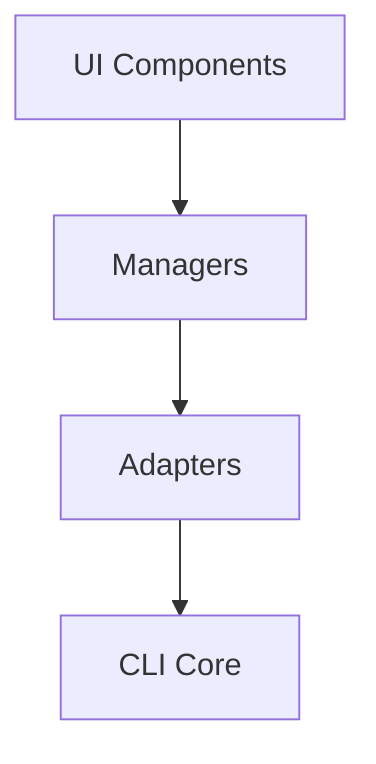

# Contributing to WireGuard Configuration Generator

Thank you for your interest in contributing to the WireGuard Configuration Generator! This document provides guidelines and instructions for contributing to both the CLI and GUI components.

## Table of Contents

- [Code of Conduct](#code-of-conduct)
- [Getting Started](#getting-started)
- [Development Setup](#development-setup)
- [Project Structure](#project-structure)
- [Development Guidelines](#development-guidelines)
- [GUI Development](#gui-development)
- [Testing](#testing)
- [Documentation](#documentation)
- [Submitting Changes](#submitting-changes)

## Code of Conduct

This project adheres to a code of conduct. By participating, you are expected to:
- Be respectful and inclusive
- Welcome newcomers and help them get started
- Focus on what is best for the community
- Show empathy towards other community members

## Getting Started

1. Fork the repository on GitHub
2. Clone your fork locally:
   ```bash
   git clone https://github.com/yourusername/wireguard-configure-generator.git
   cd wireguard-configure-generator
   ```
3. Add the upstream repository:
   ```bash
   git remote add upstream https://github.com/nerdneilsfield/wireguard-configure-generator.git
   ```

## Development Setup

### Requirements

- Python 3.12 or higher
- uv (recommended) or pip
- Make (for running development commands)

### Installation

```bash
# Using uv (recommended)
uv pip install -e ".[dev]"

# Or using pip
pip install -e ".[dev]"
```

### Development Tools

```bash
# Format code
make format

# Run linters
make lint

# Run tests
make test

# Run tests with coverage
make test-coverage
```

## Project Structure

```
wg_mesh_gen/
├── cli.py                    # CLI entry point
├── builder.py                # Configuration builder
├── loader.py                 # YAML/JSON loader
├── validator.py              # Unified validation
├── gui/                      # GUI module
│   ├── __init__.py          # GUI entry point
│   ├── __main__.py          # GUI launcher
│   ├── app.py               # Main application
│   ├── interfaces/          # Abstract interfaces
│   ├── models/              # Data models
│   ├── components/          # UI components
│   ├── managers/            # Business logic
│   ├── adapters/            # CLI integration
│   └── performance/         # Optimization
└── tests/                    # Test suite
```

## Development Guidelines

### General Principles

1. **Follow existing patterns**: Look at existing code for style and conventions
2. **Write tests**: All new features should include tests
3. **Document your code**: Use docstrings and comments where appropriate
4. **Keep it simple**: Prefer clarity over cleverness
5. **No code duplication**: Reuse existing functionality through proper abstraction

### Code Style

- Follow PEP 8 guidelines
- Use type hints for function parameters and returns
- Maximum line length: 88 characters (Black default)
- Use descriptive variable and function names

### Commit Messages

Follow conventional commit format:
```
type(scope): subject

body (optional)

footer (optional)
```

Types:
- `feat`: New feature
- `fix`: Bug fix
- `docs`: Documentation changes
- `style`: Code style changes (formatting, etc.)
- `refactor`: Code refactoring
- `test`: Test additions or changes
- `chore`: Build process or auxiliary tool changes

Example:
```
feat(gui): add minimap component for network overview

- Implement real-time miniature view
- Add viewport navigation
- Include performance optimizations for large networks

Closes #123
```

## GUI Development

### Architecture Overview

The GUI follows a clean architecture with clear separation of concerns:



### Key Principles

1. **No Duplication**: The GUI must never duplicate CLI functionality
2. **Use Adapters**: All CLI functionality is accessed through adapter classes
3. **Interface-Driven**: Components implement interfaces for consistency
4. **State Management**: Use the centralized AppState for all state

### Creating New Components

1. **Define the Interface** (if needed):
   ```python
   # gui/interfaces/components.py
   class IMyComponent(IComponent, ABC):
       @abstractmethod
       def my_method(self) -> None:
           pass
   ```

2. **Implement the Component**:
   ```python
   # gui/components/my_component.py
   from ..interfaces.components import IMyComponent
   
   class MyComponent(IMyComponent):
       def __init__(self, state: IAppState):
           self._state = state
           
       def render(self) -> ui.element:
           # NiceGUI rendering logic
           pass
   ```

3. **Add Tests**:
   ```python
   # gui/tests/test_my_component.py
   def test_my_component():
       # Test implementation
       pass
   ```

### GUI Component Guidelines

1. **Use NiceGUI Properly**:
   - Follow NiceGUI patterns for reactive UI
   - Use proper event handling
   - Leverage built-in components when possible

2. **Performance Considerations**:
   - Use the performance module for large datasets
   - Implement progressive rendering
   - Cache expensive computations

3. **Validation**:
   - Always validate user input
   - Use ValidationManager for consistency
   - Provide clear error messages

### Example: Adding a New Manager

```python
# 1. Define interface in gui/interfaces/managers.py
class IMyManager(ABC):
    @abstractmethod
    def process_data(self, data: Any) -> Any:
        pass

# 2. Implement in gui/managers/my_manager.py
class MyManager(IMyManager):
    def __init__(self):
        self.cli_adapter = CLIAdapter()
        
    def process_data(self, data: Any) -> Any:
        # Use CLI functionality through adapter
        return self.cli_adapter.some_cli_function(data)

# 3. Add tests
def test_my_manager():
    manager = MyManager()
    result = manager.process_data(test_data)
    assert result == expected
```

## Testing

### Running Tests

```bash
# All tests
make test

# Specific module
make test-file FILE=tests/test_builder.py

# GUI tests only
make test-file FILE=wg_mesh_gen/gui/tests/

# With coverage
make test-coverage
```

### Writing Tests

1. **Unit Tests**: Test individual functions and classes
2. **Integration Tests**: Test component interactions
3. **GUI Tests**: Test UI components and user workflows

Example test structure:
```python
import pytest
from wg_mesh_gen.some_module import SomeClass

class TestSomeClass:
    def test_basic_functionality(self):
        """Test basic functionality of SomeClass."""
        obj = SomeClass()
        assert obj.method() == expected_value
        
    def test_edge_case(self):
        """Test edge case handling."""
        with pytest.raises(ValueError):
            SomeClass().method_with_invalid_input(None)
```

## Documentation

### Code Documentation

- All modules should have module-level docstrings
- All classes and functions should have docstrings
- Use Google-style docstrings:

```python
def function(param1: str, param2: int) -> bool:
    """
    Brief description of function.
    
    Args:
        param1: Description of param1
        param2: Description of param2
        
    Returns:
        Description of return value
        
    Raises:
        ValueError: When validation fails
    """
    pass
```

### User Documentation

- Update README.md for new features
- Update README_zh.md for Chinese documentation
- Add examples in the `examples/` directory
- Update GUI documentation for new components

## Submitting Changes

1. **Create a Feature Branch**:
   ```bash
   git checkout -b feature/your-feature-name
   ```

2. **Make Your Changes**:
   - Write code following the guidelines
   - Add tests
   - Update documentation

3. **Run Tests and Linting**:
   ```bash
   make format
   make lint
   make test
   ```

4. **Commit Your Changes**:
   ```bash
   git add .
   git commit -m "feat: add amazing feature"
   ```

5. **Push to Your Fork**:
   ```bash
   git push origin feature/your-feature-name
   ```

6. **Create a Pull Request**:
   - Go to GitHub and create a PR from your fork
   - Fill in the PR template
   - Link any related issues

### PR Guidelines

- Keep PRs focused on a single feature or fix
- Include tests for new functionality
- Update documentation as needed
- Ensure all CI checks pass
- Respond to review feedback promptly

## Questions?

If you have questions or need help:
1. Check existing issues and discussions
2. Create a new issue for bugs or feature requests
3. Start a discussion for general questions

Thank you for contributing!