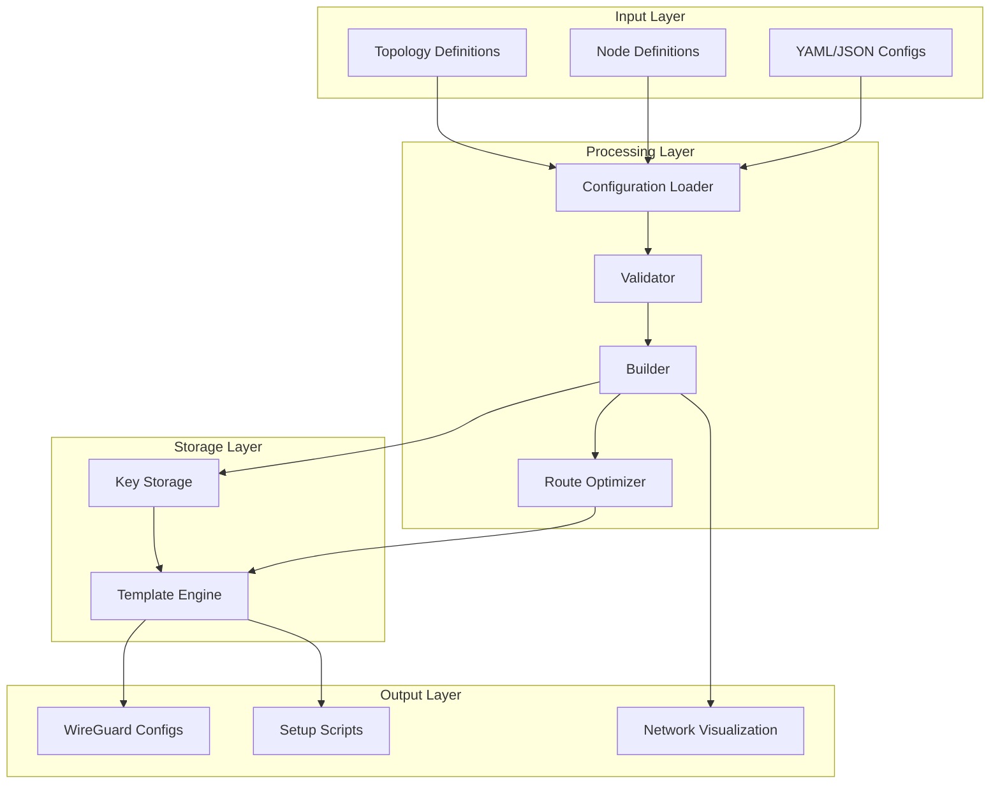
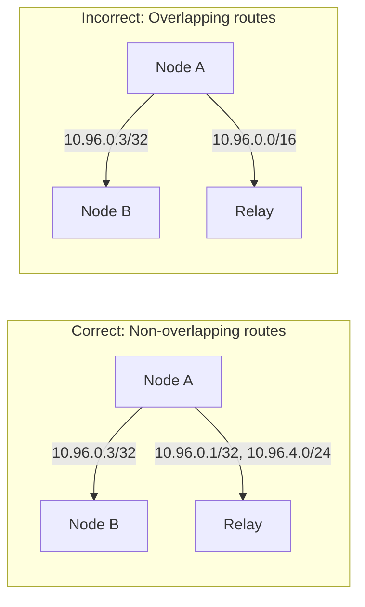

# WireGuard Configuration Generator

A powerful and flexible tool for generating WireGuard VPN configurations for complex network topologies, including mesh networks, hub-and-spoke, and multi-relay architectures.

[](https://www.python.org/downloads/)
[](LICENSE)
[](tests/)

## Features

- 🚀 **Complex Topology Support**: Mesh networks, hub-and-spoke, multi-relay configurations
- 🔐 **Automatic Key Management**: Secure key generation and storage
- 📊 **Network Visualization**: Generate network topology diagrams
- ✅ **Configuration Validation**: JSON Schema validation for configurations
- 🛠️ **Flexible Templates**: Customizable Jinja2 templates for config generation
- 🔧 **Smart Routing**: Automatic AllowedIPs optimization to avoid conflicts
- 📦 **Multiple Output Formats**: Generate configs, scripts, and documentation

## Architecture



## Installation

### Using pip
```bash
pip install -e ".[dev]"
```

### Using uv (recommended)
```bash
uv pip install -e ".[dev]"
```

## Quick Start

### 1. Basic Configuration Generation

```bash
# Generate configurations for a simple network
python -m wg_mesh_gen.cli gen \
    --nodes-file examples/nodes.yaml \
    --topo-file examples/topology.yaml \
    --output-dir output/
```

### 2. Visualize Network Topology

```bash
# Create a network diagram
python -m wg_mesh_gen.cli vis \
    --nodes-file examples/nodes.yaml \
    --topo-file examples/topology.yaml \
    --output topology.png
```

### 3. Validate Configurations

```bash
# Validate configuration files
python -m wg_mesh_gen.cli valid \
    --nodes-file examples/nodes.yaml \
    --topo-file examples/topology.yaml
```

### 4. Group Network Configuration

```bash
# Generate configurations using group-based topology
python -m wg_mesh_gen.cli gen \
    --group-config examples/group_network.yaml \
    --output-dir output/

# Visualize group network
python -m wg_mesh_gen.cli vis \
    --group-config examples/group_network.yaml \
    --output group_topology.png
```

### 5. Network Simulation

```bash
# Test network connectivity and routing
python -m wg_mesh_gen.cli simulate \
    --group-config examples/group_layered_routing.yaml \
    --test-connectivity \
    --test-routes \
    --duration 10

# Simulate node failure
python -m wg_mesh_gen.cli simulate \
    --nodes-file examples/nodes.yaml \
    --topo-file examples/topology.yaml \
    --failure-node relay1 \
    --duration 30
```

## Configuration Format

### Node Configuration

<details>
<summary>Click to expand node configuration example</summary>

```yaml
# nodes.yaml
nodes:
  - name: A
    role: client
    wireguard_ip: 10.96.0.2/16
    endpoints:
      - 192.168.1.10:51820
      - 203.0.113.10:51821  # Multiple endpoints for different peer groups
    
  - name: B
    role: client
    wireguard_ip: 10.96.0.3/16
    endpoints:
      - 192.168.1.11:51820
    
  - name: D
    role: relay
    wireguard_ip: 10.96.0.1/16
    endpoints:
      - 203.0.113.5:51820   # Public endpoint for clients
      - 203.0.113.5:51821   # Separate endpoint for peers
    listen_port: 51820
```

</details>

### Topology Configuration

<details>
<summary>Click to expand topology configuration example</summary>

```yaml
# topology.yaml
peers:
  # Direct mesh connections
  - from: A
    to: B
    endpoint: 192.168.1.11:51820
    allowed_ips:
      - 10.96.0.3/32  # Only B's IP
  
  - from: B
    to: A
    endpoint: 192.168.1.10:51820
    allowed_ips:
      - 10.96.0.2/32  # Only A's IP
  
  # Relay connections - avoid subnet overlaps
  - from: A
    to: D
    endpoint: 203.0.113.5:51820
    allowed_ips:
      - 10.96.0.1/32    # Relay's IP
      - 10.96.4.0/24    # Remote subnet accessible via relay
  
  - from: B
    to: D
    endpoint: 203.0.113.5:51820
    allowed_ips:
      - 10.96.0.1/32    # Relay's IP
      - 10.96.4.0/24    # Remote subnet accessible via relay
```

</details>

## Advanced Usage

### Group Network Configuration

The group network configuration feature simplifies complex topology definitions by allowing you to define groups of nodes and their relationships.

<details>
<summary>Click to expand group configuration example</summary>

```yaml
# group_network.yaml
nodes:
  office:
    - name: A
      wireguard_ip: 10.96.0.2/16
      endpoints:
        mesh: 192.168.1.10:51820
        public: 203.0.113.10:51820
    - name: B  
      wireguard_ip: 10.96.0.3/16
      endpoints:
        mesh: 192.168.1.11:51820
    - name: C
      wireguard_ip: 10.96.0.4/16
      endpoints:
        mesh: 192.168.1.12:51820

  campus:
    - name: D
      wireguard_ip: 10.96.0.5/16
      endpoints:
        public: 202.10.20.5:51820
    - name: E
      wireguard_ip: 10.96.0.6/16  
      endpoints:
        public: 202.10.20.6:51820

  relay:
    - name: G
      wireguard_ip: 10.96.0.254/16
      role: relay
      enable_ip_forward: true
      endpoints:
        public: 45.33.22.11:51820

groups:
  - name: office
    nodes: [A, B, C]
    topology: mesh
    mesh_endpoint: mesh  # Use 'mesh' endpoint for internal connections
    
  - name: campus
    nodes: [D, E]
    topology: mesh
    
  - name: office_to_relay
    from: office
    to: G
    type: star  # All office nodes connect to G

  - name: campus_to_relay
    from: campus
    to: G
    type: star
    
# Routing configuration for complex scenarios
routing:
  G_allowed_ips:  # IPs that G can reach
    - 10.96.0.0/16
```

</details>

**Supported Topologies:**
- `mesh`: Full mesh connectivity between all nodes in the group
- `star`: All nodes connect to a central node
- `chain`: Sequential connections (A→B→C)
- `single`: Single node connections

### Key Management

```bash
# Generate keys for a specific node
python -m wg_mesh_gen.cli keys generate NodeA

# List all stored keys
python -m wg_mesh_gen.cli keys list

# Export keys
python -m wg_mesh_gen.cli keys export --output keys.json
```

### Complex Topologies

<details>
<summary>Click to expand complex mesh network example</summary>

```yaml
# Complex mesh with multiple relay nodes and subnets
peers:
  # Group 1: Full mesh between A, B, C
  - from: A
    to: B
    allowed_ips: [10.96.0.3/32]
  
  - from: A
    to: C
    allowed_ips: [10.96.0.4/32]
  
  - from: B
    to: A
    allowed_ips: [10.96.0.2/32]
  
  - from: B
    to: C
    allowed_ips: [10.96.0.4/32]
  
  - from: C
    to: A
    allowed_ips: [10.96.0.2/32]
  
  - from: C
    to: B
    allowed_ips: [10.96.0.3/32]
  
  # Connect Group 1 to Relay D
  - from: A
    to: D
    allowed_ips:
      - 10.96.0.1/32    # Relay D
      - 10.96.4.0/24    # Group 2 subnet
  
  # Group 2: E and F with different subnet
  - from: E
    to: F
    allowed_ips: [10.96.4.3/32]
  
  - from: F
    to: E
    allowed_ips: [10.96.4.2/32]
  
  # Connect Group 2 to Relay D
  - from: E
    to: D
    allowed_ips:
      - 10.96.0.1/32    # Relay D
      - 10.96.0.0/24    # Group 1 subnet
```

</details>

### Layered Routing for Cross-Border Networks

<details>
<summary>Click to expand layered routing example</summary>

```yaml
# Example: Office nodes in China can only connect to relay G (not overseas)
# This handles GFW restrictions by using relay nodes

groups:
  - name: china_to_relay
    from: office  # Nodes in China
    to: G         # Relay accessible from China
    type: star
    
  - name: relay_to_overseas  
    from: G       # Relay node
    to: [H, I]    # Overseas nodes
    type: star

routing:
  # G can forward traffic between China and overseas
  G_allowed_ips:
    - 10.96.0.0/24    # China subnet
    - 10.96.1.0/24    # Overseas subnet
    
  # Office nodes route overseas traffic through G
  office_allowed_ips:
    - 10.96.0.254/32  # G's IP
    - 10.96.1.0/24    # Overseas subnet (via G)
```

The system automatically generates PostUp/PostDown scripts for relay nodes to enable IP forwarding.

</details>

### Network Visualization Options

```bash
# Different layout algorithms
python -m wg_mesh_gen.cli vis \
    --nodes-file nodes.yaml \
    --topo-file topology.yaml \
    --layout hierarchical \
    --output network.png

# Visualize group configurations
python -m wg_mesh_gen.cli vis \
    --group-config group_network.yaml \
    --layout hierarchical \
    --output group_topology.png

# Available layouts: auto, spring, circular, shell, hierarchical, kamada_kawai
```

## Best Practices

### 1. AllowedIPs Configuration



**Key Principles:**
- Use specific /32 addresses for direct peer connections
- Only include necessary subnets in relay connections
- Avoid overlapping IP ranges between peers
- Define bidirectional connections explicitly

### 2. Security Considerations

- Store private keys securely (use encrypted storage in production)
- Regularly rotate pre-shared keys
- Use firewall rules to restrict WireGuard port access
- Monitor for unauthorized connection attempts

### 3. Performance Optimization

- Use persistent keepalive only when necessary (behind NAT)
- Optimize MTU settings for your network
- Consider using multiple endpoints for load balancing
- Monitor bandwidth usage and adjust routing

## Testing

```bash
# Run all tests
make test

# Run specific test module
make test-file FILE=tests/test_builder.py

# Run with coverage
make test-coverage
```

## Development

### Project Structure

```
wg_mesh_gen/
├── cli.py              # Command-line interface
├── builder.py          # Configuration builder
├── loader.py           # YAML/JSON loader with validation
├── models.py           # Data models
├── render.py           # Template rendering
├── visualizer.py       # Network visualization
├── crypto.py           # Cryptographic operations
├── simple_storage.py   # Key storage implementation
└── schemas/            # JSON schemas for validation
```

### Contributing

1. Fork the repository
2. Create a feature branch (`git checkout -b feature/amazing-feature`)
3. Commit your changes (`git commit -m 'Add amazing feature'`)
4. Push to the branch (`git push origin feature/amazing-feature`)
5. Open a Pull Request

### Code Style

```bash
# Format code
make format

# Run linting
make lint
```

## Troubleshooting

### Common Issues

<details>
<summary>Click to expand troubleshooting guide</summary>

**1. "AllowedIPs overlap" Warning**
- Check for overlapping subnets in your topology
- Use specific /32 addresses for direct connections
- See [AllowedIPs Best Practices](docs/allowed_ips_best_practices.md)

**2. "Failed to validate configuration"**
- Ensure YAML syntax is correct
- Check that all referenced nodes exist
- Validate endpoint format (IP:port)

**3. "Key not found for node"**
- Generate keys using `python -m wg_mesh_gen.cli keys generate <node>`
- Or use `--auto-keys` flag during generation

**4. Connection Issues**
- Verify firewall rules allow WireGuard ports
- Check NAT/routing configuration
- Use `wg show` to debug active connections

</details>

## License

This project is licensed under the MIT License - see the [LICENSE](LICENSE) file for details.

## Acknowledgments

- WireGuard® is a registered trademark of Jason A. Donenfeld
- Built with Python, Click, Jinja2, and NetworkX
- Inspired by the need for automated WireGuard deployment in complex networks

## Links

- [WireGuard Official Documentation](https://www.wireguard.com/)
- [Project Issues](https://github.com/yourusername/wireguard-config-generator/issues)
- [Changelog](CHANGELOG.md)
