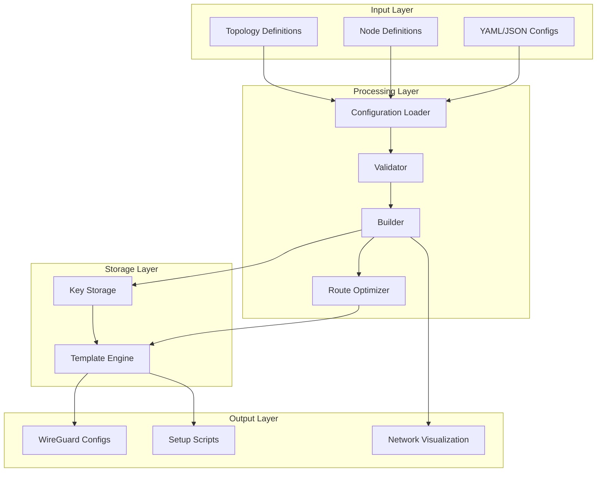
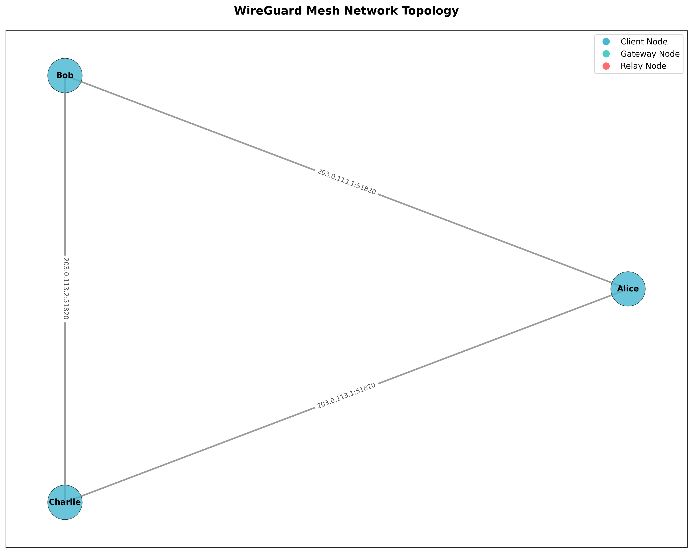
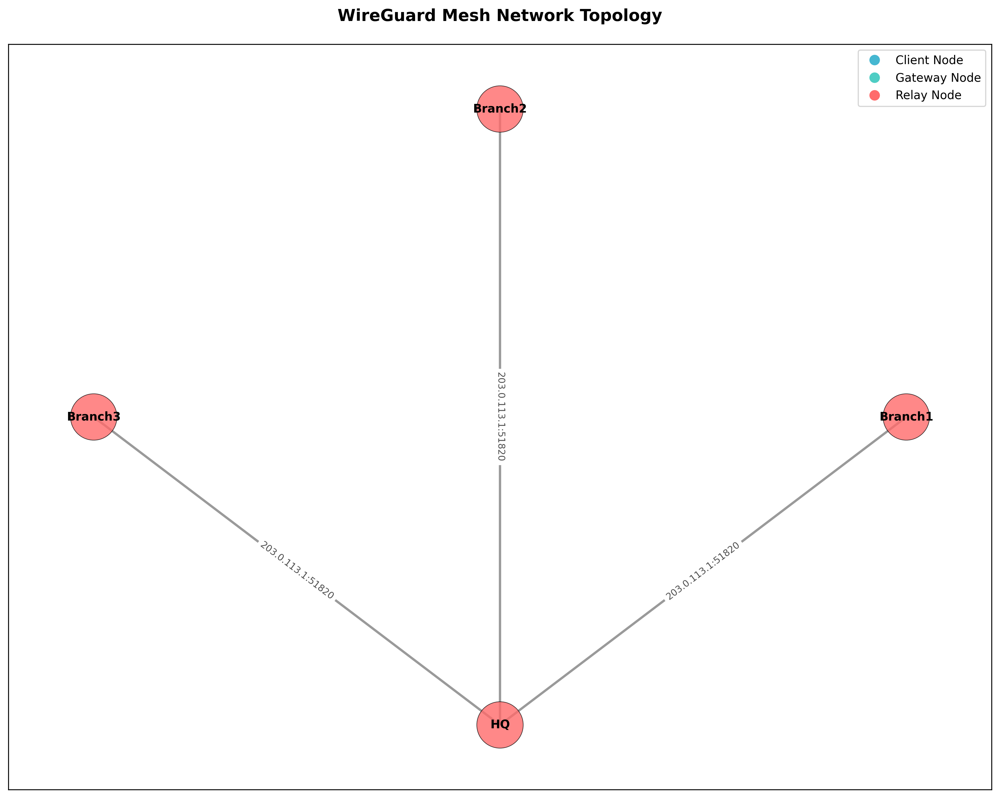
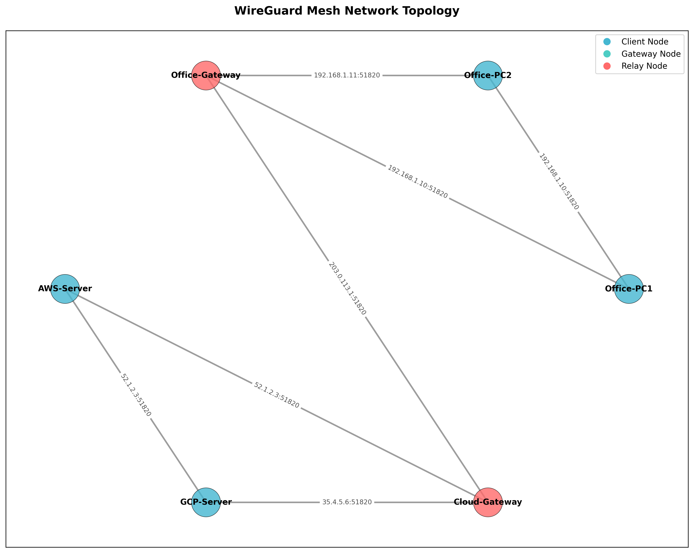
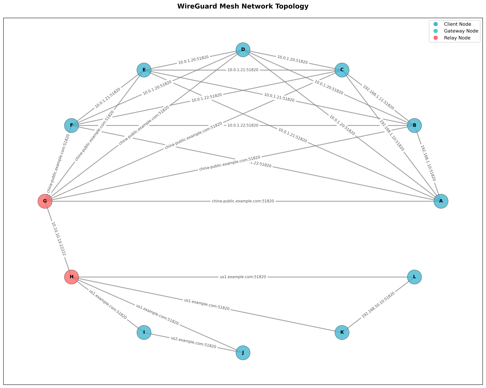
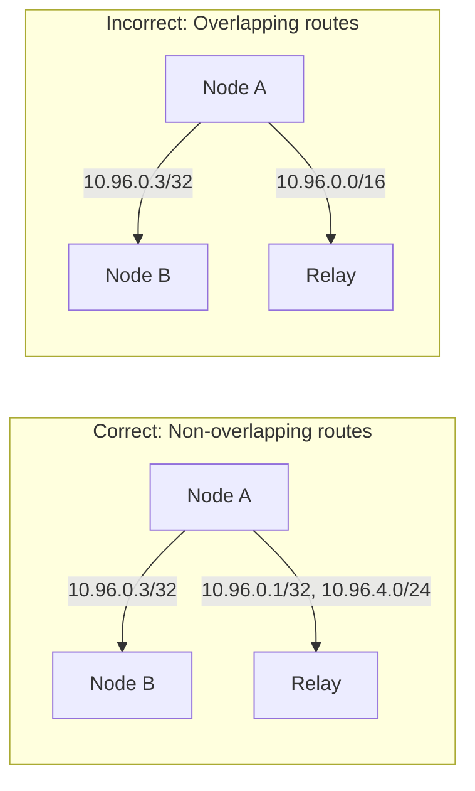
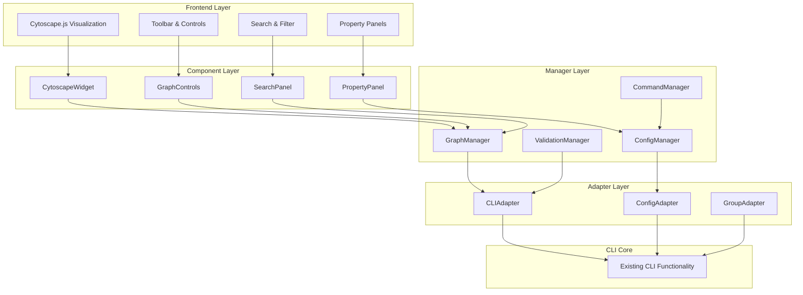

# WireGuard Configuration Generator

A powerful and flexible tool for generating WireGuard VPN configurations for complex network topologies, including mesh networks, hub-and-spoke, and multi-relay architectures.

[](https://www.python.org/downloads/)
[](LICENSE)
[](tests/)

## Features

- 🚀 **Complex Topology Support**: Mesh networks, hub-and-spoke, multi-relay configurations
- 🔐 **Automatic Key Management**: Secure key generation and storage
- 📊 **Network Visualization**: Generate network topology diagrams
- ✅ **Configuration Validation**: JSON Schema validation for configurations
- 🛠️ **Flexible Templates**: Customizable Jinja2 templates for config generation
- 🔧 **Smart Routing**: Automatic AllowedIPs optimization to avoid conflicts
- 📦 **Multiple Output Formats**: Generate configs, scripts, and documentation

## Architecture



## Installation

### Using pip
```bash
pip install -e ".[dev]"
```

### Using uv (recommended)
```bash
uv pip install -e ".[dev]"
```

## Quick Start

### 1. Basic Configuration Generation

```bash
# Generate configurations for a simple network
python -m wg_mesh_gen.cli gen \
    --nodes-file examples/nodes.yaml \
    --topo-file examples/topology.yaml \
    --output-dir output/
```

### 2. Visualize Network Topology

```bash
# Create a network diagram
python -m wg_mesh_gen.cli vis \
    --nodes-file examples/nodes.yaml \
    --topo-file examples/topology.yaml \
    --output topology.png
```

### 3. Validate Configurations

```bash
# Validate configuration files
python -m wg_mesh_gen.cli valid \
    --nodes-file examples/nodes.yaml \
    --topo-file examples/topology.yaml
```

### 4. Group Network Configuration

```bash
# Generate configurations using group-based topology
python -m wg_mesh_gen.cli gen \
    --group-config examples/group_network.yaml \
    --output-dir output/

# Visualize group network
python -m wg_mesh_gen.cli vis \
    --group-config examples/group_network.yaml \
    --output group_topology.png
```

### 5. Network Simulation

```bash
# Test network connectivity and routing
python -m wg_mesh_gen.cli simulate \
    --group-config examples/group_layered_routing.yaml \
    --test-connectivity \
    --test-routes \
    --duration 10

# Simulate node failure
python -m wg_mesh_gen.cli simulate \
    --nodes-file examples/nodes.yaml \
    --topo-file examples/topology.yaml \
    --failure-node relay1 \
    --duration 30
```

## Configuration Format

### Node Configuration

<details>
<summary>Click to expand node configuration example</summary>

```yaml
# nodes.yaml
nodes:
  - name: A
    role: client
    wireguard_ip: 10.96.0.2/16
    endpoints:
      - 192.168.1.10:51820
      - 203.0.113.10:51821  # Multiple endpoints for different peer groups
    
  - name: B
    role: client
    wireguard_ip: 10.96.0.3/16
    endpoints:
      - 192.168.1.11:51820
    
  - name: D
    role: relay
    wireguard_ip: 10.96.0.1/16
    endpoints:
      - 203.0.113.5:51820   # Public endpoint for clients
      - 203.0.113.5:51821   # Separate endpoint for peers
    listen_port: 51820
```

</details>

### Topology Configuration

<details>
<summary>Click to expand topology configuration example</summary>

```yaml
# topology.yaml
peers:
  # Direct mesh connections
  - from: A
    to: B
    endpoint: 192.168.1.11:51820
    allowed_ips:
      - 10.96.0.3/32  # Only B's IP
  
  - from: B
    to: A
    endpoint: 192.168.1.10:51820
    allowed_ips:
      - 10.96.0.2/32  # Only A's IP
  
  # Relay connections - avoid subnet overlaps
  - from: A
    to: D
    endpoint: 203.0.113.5:51820
    allowed_ips:
      - 10.96.0.1/32    # Relay's IP
      - 10.96.4.0/24    # Remote subnet accessible via relay
  
  - from: B
    to: D
    endpoint: 203.0.113.5:51820
    allowed_ips:
      - 10.96.0.1/32    # Relay's IP
      - 10.96.4.0/24    # Remote subnet accessible via relay
```

</details>

## Advanced Usage

### Group Network Configuration

The group network configuration feature simplifies complex topology definitions by allowing you to define groups of nodes and their relationships. See the [detailed group configuration guide](docs/group_config_guide.md) for comprehensive documentation.

#### Configuration Structure

```yaml
# Basic structure of a group configuration file
nodes:
  group_name:        # Logical grouping of nodes
    - name: node_name
      wireguard_ip: IP/subnet
      endpoints:
        endpoint_name: address:port
      
groups:              # Define connections between nodes
  - name: group_name
    nodes: [...]
    topology: mesh|star|chain|single
    
routing:             # Optional: Custom routing rules
  node_allowed_ips:
    - subnet1
    - subnet2
```

#### Topology Types

**1. Mesh Topology** - All nodes connect to each other



```yaml
groups:
  - name: team_mesh
    nodes: [Alice, Bob, Charlie]
    topology: mesh
```

**2. Star Topology** - All nodes connect to a central hub



```yaml
groups:
  - name: branches_to_hq
    from: branches
    to: HQ
    type: star
```

**3. Complex Multi-Site Network**



<details>
<summary>Click to expand complex network configuration</summary>

```yaml
nodes:
  office:
    - name: Office-PC1
      wireguard_ip: 10.1.0.10/16
      endpoints:
        lan: 192.168.1.10:51820
    - name: Office-PC2
      wireguard_ip: 10.1.0.11/16
      endpoints:
        lan: 192.168.1.11:51820
        
  cloud:
    - name: AWS-Server
      wireguard_ip: 10.2.0.10/16
      endpoints:
        public: 52.1.2.3:51820
    - name: GCP-Server
      wireguard_ip: 10.2.0.11/16
      endpoints:
        public: 35.4.5.6:51820
        
  relays:
    - name: Office-Gateway
      wireguard_ip: 10.1.0.1/16
      role: relay
      enable_ip_forward: true
      endpoints:
        lan: 192.168.1.1:51820
        public: 203.0.113.1:51820
    - name: Cloud-Gateway
      wireguard_ip: 10.2.0.1/16
      role: relay
      enable_ip_forward: true
      endpoints:
        public: 54.7.8.9:51820

groups:
  # Office internal mesh
  - name: office_mesh
    nodes: [Office-PC1, Office-PC2]
    topology: mesh
    mesh_endpoint: lan  # Use LAN endpoint for internal
    
  # Cloud servers mesh
  - name: cloud_mesh
    nodes: [AWS-Server, GCP-Server]
    topology: mesh
    
  # Office to gateway connections
  - name: office_to_gateway
    from: office
    to: Office-Gateway
    type: star
    
  # Cloud to gateway connections
  - name: cloud_to_gateway
    from: cloud
    to: Cloud-Gateway
    type: star
    
  # Gateway interconnection
  - name: gateway_link
    from: Office-Gateway
    to: Cloud-Gateway
    type: single

routing:
  # Define which subnets each gateway can route
  Office-Gateway_allowed_ips:
    - 10.1.0.0/24  # Office subnet
    - 10.2.0.0/24  # Cloud subnet (via Cloud-Gateway)
  Cloud-Gateway_allowed_ips:
    - 10.2.0.0/24  # Cloud subnet
    - 10.1.0.0/24  # Office subnet (via Office-Gateway)
```

</details>

### Key Management

```bash
# Generate keys for a specific node
python -m wg_mesh_gen.cli keys generate NodeA

# List all stored keys
python -m wg_mesh_gen.cli keys list

# Export keys
python -m wg_mesh_gen.cli keys export --output keys.json
```

### Complex Topologies

<details>
<summary>Click to expand complex mesh network example</summary>

```yaml
# Complex mesh with multiple relay nodes and subnets
peers:
  # Group 1: Full mesh between A, B, C
  - from: A
    to: B
    allowed_ips: [10.96.0.3/32]
  
  - from: A
    to: C
    allowed_ips: [10.96.0.4/32]
  
  - from: B
    to: A
    allowed_ips: [10.96.0.2/32]
  
  - from: B
    to: C
    allowed_ips: [10.96.0.4/32]
  
  - from: C
    to: A
    allowed_ips: [10.96.0.2/32]
  
  - from: C
    to: B
    allowed_ips: [10.96.0.3/32]
  
  # Connect Group 1 to Relay D
  - from: A
    to: D
    allowed_ips:
      - 10.96.0.1/32    # Relay D
      - 10.96.4.0/24    # Group 2 subnet
  
  # Group 2: E and F with different subnet
  - from: E
    to: F
    allowed_ips: [10.96.4.3/32]
  
  - from: F
    to: E
    allowed_ips: [10.96.4.2/32]
  
  # Connect Group 2 to Relay D
  - from: E
    to: D
    allowed_ips:
      - 10.96.0.1/32    # Relay D
      - 10.96.0.0/24    # Group 1 subnet
```

</details>

### Layered Routing for Cross-Border Networks

For networks that span regions with connectivity restrictions (e.g., GFW), use layered routing with relay nodes:



<details>
<summary>Click to expand layered routing configuration</summary>

```yaml
# Example: Office nodes in China can only connect to relay G (not overseas)
# This handles GFW restrictions by using relay nodes

nodes:
  china:
    - name: cn-office1
      wireguard_ip: 10.96.0.10/16
      endpoints:
        internal: 192.168.1.10:51820
    - name: cn-office2
      wireguard_ip: 10.96.0.11/16
      endpoints:
        internal: 192.168.1.11:51820
        
  hongkong:
    - name: hk-relay
      wireguard_ip: 10.96.1.1/16
      role: relay
      enable_ip_forward: true
      endpoints:
        public: 45.45.45.45:51820  # Accessible from mainland
        
  overseas:
    - name: us-server
      wireguard_ip: 10.96.2.10/16
      endpoints:
        public: 1.2.3.4:51820
    - name: eu-server
      wireguard_ip: 10.96.3.10/16
      endpoints:
        public: 5.6.7.8:51820

groups:
  # China offices can only connect to HK relay
  - name: china_to_relay
    from: china  # Nodes in China
    to: hk-relay # Relay accessible from China
    type: star
    
  # HK relay connects to overseas servers
  - name: relay_to_overseas  
    from: hk-relay  # Relay node
    to: [us-server, eu-server]  # Overseas nodes
    type: star

routing:
  # HK relay can forward traffic between China and overseas
  hk-relay_allowed_ips:
    - 10.96.0.0/24    # China subnet
    - 10.96.2.0/24    # US subnet
    - 10.96.3.0/24    # EU subnet
    
  # China offices route overseas traffic through HK
  china_allowed_ips:
    - 10.96.1.1/32    # HK relay IP
    - 10.96.2.0/24    # US subnet (via HK)
    - 10.96.3.0/24    # EU subnet (via HK)
```

The system automatically generates PostUp/PostDown scripts for relay nodes to enable IP forwarding:
```bash
PostUp = sysctl -w net.ipv4.ip_forward=1
PostUp = sysctl -w net.ipv6.conf.all.forwarding=1
```

</details>

### Network Visualization Options

```bash
# Different layout algorithms
python -m wg_mesh_gen.cli vis \
    --nodes-file nodes.yaml \
    --topo-file topology.yaml \
    --layout hierarchical \
    --output network.png

# Visualize group configurations
python -m wg_mesh_gen.cli vis \
    --group-config group_network.yaml \
    --layout hierarchical \
    --output group_topology.png

# Available layouts: auto, spring, circular, shell, hierarchical, kamada_kawai
```

## Best Practices

### 1. AllowedIPs Configuration



**Key Principles:**
- Use specific /32 addresses for direct peer connections
- Only include necessary subnets in relay connections
- Avoid overlapping IP ranges between peers
- Define bidirectional connections explicitly

### 2. Security Considerations

- Store private keys securely (use encrypted storage in production)
- Regularly rotate pre-shared keys
- Use firewall rules to restrict WireGuard port access
- Monitor for unauthorized connection attempts

### 3. Performance Optimization

- Use persistent keepalive only when necessary (behind NAT)
- Optimize MTU settings for your network
- Consider using multiple endpoints for load balancing
- Monitor bandwidth usage and adjust routing

## Visual Examples

### Network Topology Gallery

<table>
<tr>
<td align="center">

<br>
<b>Mesh Network</b><br>
Full connectivity between all nodes
</td>
<td align="center">

<br>
<b>Star Topology</b><br>
Central hub with spoke connections
</td>
</tr>
<tr>
<td align="center">

<br>
<b>Multi-Site Network</b><br>
Office and cloud sites with gateways
</td>
<td align="center">

<br>
<b>Layered Routing</b><br>
Cross-border network with relay nodes
</td>
</tr>
</table>

## GUI - Visual Configuration Editor

The WireGuard Configuration Generator includes a powerful web-based GUI for visual network configuration and management.

### Features

- 🎨 **Interactive Network Visualization**: Drag-and-drop network design with Cytoscape.js
- 📊 **Real-time Configuration**: Edit nodes, edges, and groups with instant validation
- 🔍 **Advanced Search**: Find nodes by name, IP, endpoint, or group membership  
- 📈 **Performance Optimization**: Handles large networks with caching and LOD rendering
- 💾 **Import/Export**: Support for all configuration formats (YAML, JSON, WireGuard)
- 🎯 **Smart Layouts**: Multiple layout algorithms for optimal visualization
- 🔧 **Property Editing**: Comprehensive property panels for all network elements

### Starting the GUI

```bash
# Start the GUI server
python -m wg_mesh_gen.gui

# Specify custom host and port
python -m wg_mesh_gen.gui --host 0.0.0.0 --port 8080

# Enable dark mode
python -m wg_mesh_gen.gui --dark

# Development mode with auto-reload
python -m wg_mesh_gen.gui --reload
```

The GUI will be available at `http://localhost:8000` by default.

### GUI Architecture



### GUI Usage Guide

#### 1. Creating a Network

1. **Add Nodes**: Click the "Add Node" button or right-click on the canvas
2. **Configure Node**: 
   - Set name and WireGuard IP
   - Choose role (client/relay)
   - Add endpoints for relay nodes
3. **Connect Nodes**: 
   - Click and drag between nodes to create connections
   - Or use the toolbar connection tool

#### 2. Working with Groups

1. **Create Group**: Use the toolbar or right-click menu
2. **Add Members**: Drag nodes into the group
3. **Set Topology**: Choose mesh, star, chain, or single
4. **Apply Layout**: Auto-arrange nodes based on topology

#### 3. Import/Export

**Import Options:**
- Drag and drop configuration files onto the canvas
- Use File → Import menu
- Support for nodes.yaml, topology.yaml, and group configurations

**Export Options:**
- File → Export → WireGuard Configs
- File → Export → YAML/JSON
- File → Export → Network Diagram (PNG)

#### 4. Advanced Features

**Search and Filter:**
```
- Search by name: "relay"
- Search by IP: "10.96"
- Search by endpoint: "example.com"
- Filter by role or edge type
```

**Keyboard Shortcuts:**
- `Ctrl+S`: Save configuration
- `Ctrl+O`: Open file
- `Ctrl+Z/Y`: Undo/Redo
- `Delete`: Remove selected
- `Ctrl+A`: Select all
- `F`: Fit to viewport
- `Ctrl+F`: Focus search

**Performance Settings:**
- For networks > 100 nodes: Enable "Performance Mode" in settings
- Adjust LOD (Level of Detail) thresholds
- Toggle animations for better performance

#### 5. Validation and Testing

The GUI provides real-time validation:
- ✅ IP address conflicts
- ✅ Subnet overlaps  
- ✅ Missing required fields
- ✅ Invalid endpoint formats
- ✅ Topology constraints

Use the "Validate" button to run comprehensive checks before exporting.

### GUI Components

| Component | Description | Features |
|-----------|-------------|----------|
| **CytoscapeWidget** | Main network visualization | Drag/drop, zoom/pan, selection |
| **PropertyPanel** | Element property editor | Validation, dynamic forms |
| **GraphControls** | Visualization controls | Zoom, layouts, view presets |
| **SearchPanel** | Search and filter | Full-text search, filters |
| **Minimap** | Network overview | Navigation, viewport indicator |
| **Toolbar** | Main actions | Add/remove, import/export |
| **StatusBar** | System status | Node/edge count, validation |

### Performance Tips

For large networks (>500 nodes):

1. **Use Performance Mode**: Settings → Performance → Enable
2. **Disable Animations**: View → Toggle Animations
3. **Hide Labels**: View → Toggle Labels
4. **Use Fast Layouts**: Prefer "Grid" or "Circle" over "Force-Directed"
5. **Progressive Loading**: Import in batches for very large configs

## Testing

```bash
# Run all tests
make test

# Run specific test module
make test-file FILE=tests/test_builder.py

# Run with coverage
make test-coverage
```

## Development

### Project Structure

```
wg_mesh_gen/
├── cli.py              # Command-line interface
├── builder.py          # Configuration builder
├── loader.py           # YAML/JSON loader with validation
├── models.py           # Data models
├── render.py           # Template rendering
├── visualizer.py       # Network visualization
├── crypto.py           # Cryptographic operations
├── simple_storage.py   # Key storage implementation
└── schemas/            # JSON schemas for validation
```

### Contributing

1. Fork the repository
2. Create a feature branch (`git checkout -b feature/amazing-feature`)
3. Commit your changes (`git commit -m 'Add amazing feature'`)
4. Push to the branch (`git push origin feature/amazing-feature`)
5. Open a Pull Request

### Code Style

```bash
# Format code
make format

# Run linting
make lint
```

## Troubleshooting

### Common Issues

<details>
<summary>Click to expand troubleshooting guide</summary>

**1. "AllowedIPs overlap" Warning**
- Check for overlapping subnets in your topology
- Use specific /32 addresses for direct connections
- See [AllowedIPs Best Practices](docs/allowed_ips_best_practices.md)

**2. "Failed to validate configuration"**
- Ensure YAML syntax is correct
- Check that all referenced nodes exist
- Validate endpoint format (IP:port)

**3. "Key not found for node"**
- Generate keys using `python -m wg_mesh_gen.cli keys generate <node>`
- Or use `--auto-keys` flag during generation

**4. Connection Issues**
- Verify firewall rules allow WireGuard ports
- Check NAT/routing configuration
- Use `wg show` to debug active connections

</details>

## License

This project is licensed under the MIT License - see the [LICENSE](LICENSE) file for details.

## Acknowledgments

- WireGuard® is a registered trademark of Jason A. Donenfeld
- Built with Python, Click, Jinja2, and NetworkX
- Inspired by the need for automated WireGuard deployment in complex networks

## Links

- [WireGuard Official Documentation](https://www.wireguard.com/)
- [Project Issues](https://github.com/yourusername/wireguard-config-generator/issues)
- [Changelog](CHANGELOG.md)
