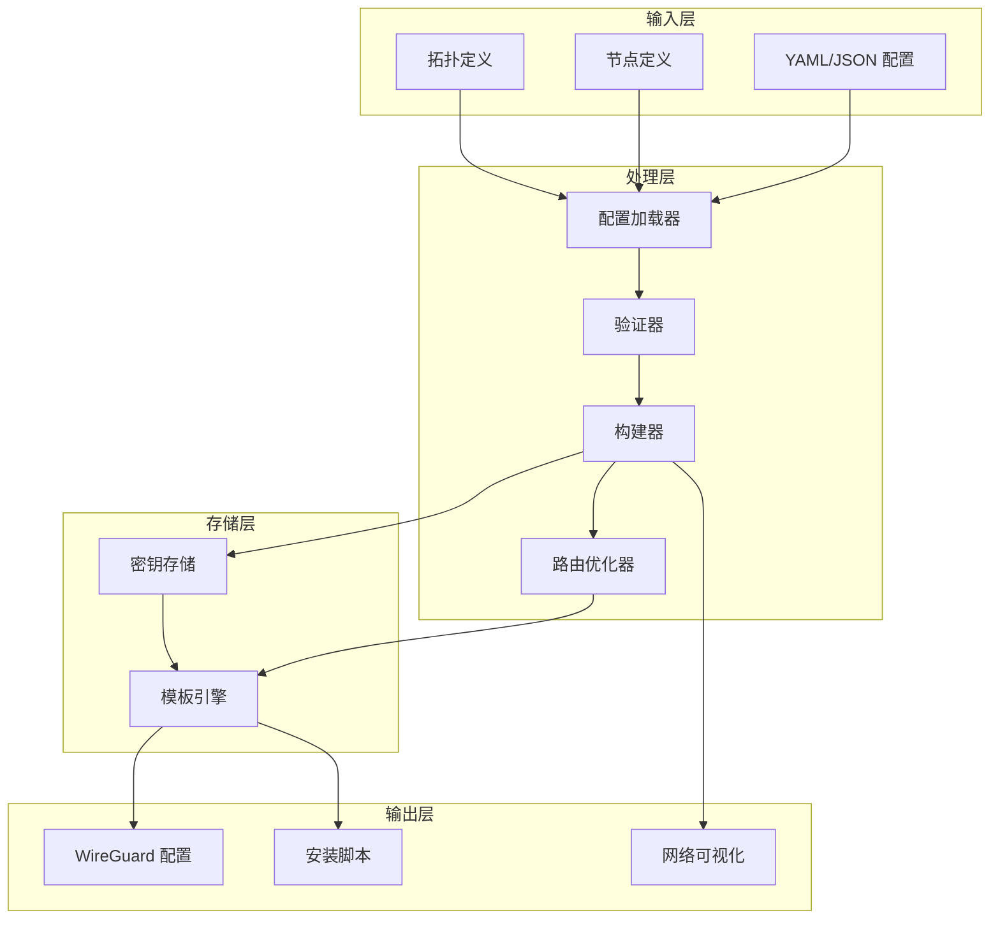
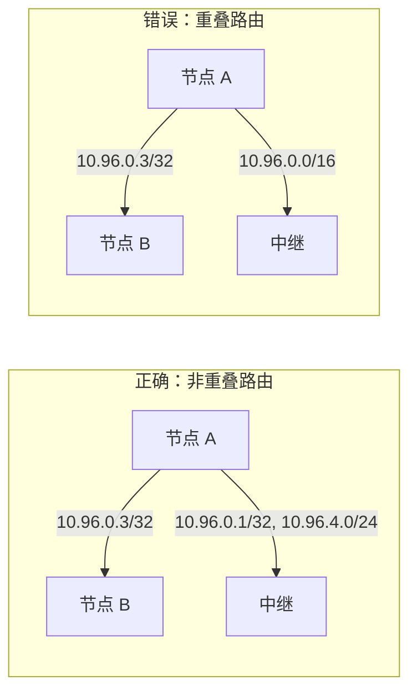
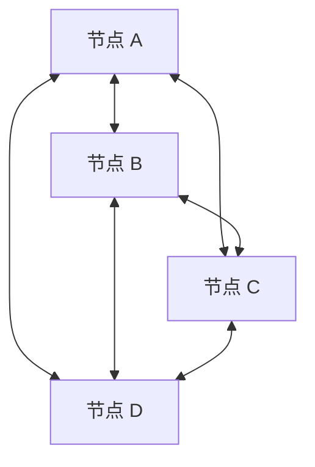
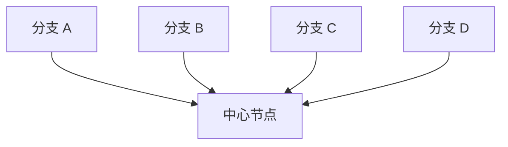
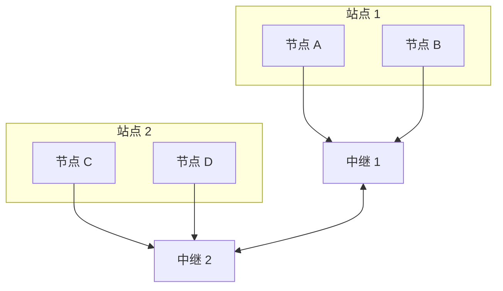

# WireGuard 配置生成器

一个强大而灵活的工具，用于为复杂网络拓扑生成 WireGuard VPN 配置，包括网状网络、星型网络和多中继架构。

[](https://www.python.org/downloads/)
[](LICENSE)
[](tests/)

[English](README.md) | 中文

## 功能特性

- 🚀 **复杂拓扑支持**：网状网络、星型网络、多中继配置
- 🔐 **自动密钥管理**：安全的密钥生成和存储
- 📊 **网络可视化**：生成网络拓扑图
- ✅ **配置验证**：JSON Schema 配置验证
- 🛠️ **灵活模板**：可定制的 Jinja2 模板用于配置生成
- 🔧 **智能路由**：自动 AllowedIPs 优化以避免冲突
- 📦 **多种输出格式**：生成配置、脚本和文档

## 架构



## 安装

### 使用 pip
```bash
pip install -e ".[dev]"
```

### 使用 uv（推荐）
```bash
uv pip install -e ".[dev]"
```

## 快速开始

### 1. 基本配置生成

```bash
# 为简单网络生成配置
python -m wg_mesh_gen.cli gen \
    --nodes-file examples/nodes.yaml \
    --topo-file examples/topology.yaml \
    --output-dir output/
```

### 2. 网络拓扑可视化

```bash
# 创建网络图
python -m wg_mesh_gen.cli vis \
    --nodes-file examples/nodes.yaml \
    --topo-file examples/topology.yaml \
    --output topology.png
```

### 3. 验证配置

```bash
# 验证配置文件
python -m wg_mesh_gen.cli valid \
    --nodes-file examples/nodes.yaml \
    --topo-file examples/topology.yaml
```

## 配置格式

### 节点配置

<details>
<summary>点击展开节点配置示例</summary>

```yaml
# nodes.yaml
nodes:
  - name: A
    role: client
    wireguard_ip: 10.96.0.2/16
    endpoints:
      - 192.168.1.10:51820
      - 203.0.113.10:51821  # 为不同对等组提供多个端点
    
  - name: B
    role: client
    wireguard_ip: 10.96.0.3/16
    endpoints:
      - 192.168.1.11:51820
    
  - name: D
    role: relay
    wireguard_ip: 10.96.0.1/16
    endpoints:
      - 203.0.113.5:51820   # 客户端公共端点
      - 203.0.113.5:51821   # 对等节点单独端点
    listen_port: 51820
```

</details>

### 拓扑配置

<details>
<summary>点击展开拓扑配置示例</summary>

```yaml
# topology.yaml
peers:
  # 直接网状连接
  - from: A
    to: B
    endpoint: 192.168.1.11:51820
    allowed_ips:
      - 10.96.0.3/32  # 仅 B 的 IP
  
  - from: B
    to: A
    endpoint: 192.168.1.10:51820
    allowed_ips:
      - 10.96.0.2/32  # 仅 A 的 IP
  
  # 中继连接 - 避免子网重叠
  - from: A
    to: D
    endpoint: 203.0.113.5:51820
    allowed_ips:
      - 10.96.0.1/32    # 中继的 IP
      - 10.96.4.0/24    # 通过中继可访问的远程子网
  
  - from: B
    to: D
    endpoint: 203.0.113.5:51820
    allowed_ips:
      - 10.96.0.1/32    # 中继的 IP
      - 10.96.4.0/24    # 通过中继可访问的远程子网
```

</details>

## 高级用法

### 密钥管理

```bash
# 为特定节点生成密钥
python -m wg_mesh_gen.cli keys generate NodeA

# 列出所有存储的密钥
python -m wg_mesh_gen.cli keys list

# 导出密钥
python -m wg_mesh_gen.cli keys export --output keys.json
```

### 复杂拓扑

<details>
<summary>点击展开复杂网状网络示例</summary>

```yaml
# 具有多个中继节点和子网的复杂网状网络
peers:
  # 组 1：A、B、C 之间的全网状连接
  - from: A
    to: B
    allowed_ips: [10.96.0.3/32]
  
  - from: A
    to: C
    allowed_ips: [10.96.0.4/32]
  
  - from: B
    to: A
    allowed_ips: [10.96.0.2/32]
  
  - from: B
    to: C
    allowed_ips: [10.96.0.4/32]
  
  - from: C
    to: A
    allowed_ips: [10.96.0.2/32]
  
  - from: C
    to: B
    allowed_ips: [10.96.0.3/32]
  
  # 将组 1 连接到中继 D
  - from: A
    to: D
    allowed_ips:
      - 10.96.0.1/32    # 中继 D
      - 10.96.4.0/24    # 组 2 子网
  
  # 组 2：E 和 F 使用不同子网
  - from: E
    to: F
    allowed_ips: [10.96.4.3/32]
  
  - from: F
    to: E
    allowed_ips: [10.96.4.2/32]
  
  # 将组 2 连接到中继 D
  - from: E
    to: D
    allowed_ips:
      - 10.96.0.1/32    # 中继 D
      - 10.96.0.0/24    # 组 1 子网
```

</details>

### 网络可视化选项

```bash
# 不同的布局算法
python -m wg_mesh_gen.cli vis \
    --nodes-file nodes.yaml \
    --topo-file topology.yaml \
    --layout hierarchical \
    --output network.png

# 可用布局：auto、spring、circular、shell、hierarchical、kamada_kawai
```

## 最佳实践

### 1. AllowedIPs 配置



**关键原则：**
- 对直接对等连接使用特定的 /32 地址
- 在中继连接中仅包含必要的子网
- 避免对等节点之间的 IP 范围重叠
- 明确定义双向连接

### 2. 安全考虑

- 安全存储私钥（生产环境中使用加密存储）
- 定期轮换预共享密钥
- 使用防火墙规则限制 WireGuard 端口访问
- 监控未授权的连接尝试

### 3. 性能优化

- 仅在必要时使用持久保活（在 NAT 后面）
- 为您的网络优化 MTU 设置
- 考虑使用多个端点进行负载均衡
- 监控带宽使用并调整路由

## 测试

```bash
# 运行所有测试
make test

# 运行特定测试模块
make test-file FILE=tests/test_builder.py

# 运行覆盖率测试
make test-coverage
```

## 开发

### 项目结构

```
wg_mesh_gen/
├── cli.py              # 命令行界面
├── builder.py          # 配置构建器
├── loader.py           # 带验证的 YAML/JSON 加载器
├── models.py           # 数据模型
├── render.py           # 模板渲染
├── visualizer.py       # 网络可视化
├── crypto.py           # 加密操作
├── simple_storage.py   # 密钥存储实现
└── schemas/            # 用于验证的 JSON 模式
```

### 贡献

1. Fork 本仓库
2. 创建功能分支（`git checkout -b feature/amazing-feature`）
3. 提交更改（`git commit -m 'Add amazing feature'`）
4. 推送到分支（`git push origin feature/amazing-feature`）
5. 创建 Pull Request

### 代码风格

```bash
# 格式化代码
make format

# 运行检查
make lint
```

## 故障排除

### 常见问题

<details>
<summary>点击展开故障排除指南</summary>

**1. "AllowedIPs 重叠" 警告**
- 检查拓扑中的重叠子网
- 对直接连接使用特定的 /32 地址
- 参见 [AllowedIPs 最佳实践](docs/allowed_ips_best_practices.md)

**2. "配置验证失败"**
- 确保 YAML 语法正确
- 检查所有引用的节点是否存在
- 验证端点格式（IP:端口）

**3. "未找到节点的密钥"**
- 使用 `python -m wg_mesh_gen.cli keys generate <node>` 生成密钥
- 或在生成时使用 `--auto-keys` 标志

**4. 连接问题**
- 验证防火墙规则允许 WireGuard 端口
- 检查 NAT/路由配置
- 使用 `wg show` 调试活动连接

</details>

## 常见拓扑模式

### 1. 全网状网络



### 2. 星型网络（Hub-and-Spoke）



### 3. 多中继网络



## 许可证

本项目采用 MIT 许可证 - 详见 [LICENSE](LICENSE) 文件。

## 致谢

- WireGuard® 是 Jason A. Donenfeld 的注册商标
- 使用 Python、Click、Jinja2 和 NetworkX 构建
- 灵感来自于在复杂网络中自动部署 WireGuard 的需求

## 链接

- [WireGuard 官方文档](https://www.wireguard.com/)
- [项目问题](https://github.com/yourusername/wireguard-config-generator/issues)
- [更新日志](CHANGELOG.md)