# WireGuard 配置生成器

一个强大而灵活的工具，用于为复杂网络拓扑生成 WireGuard VPN 配置，包括网状网络、中心辐射型和多中继架构。

[](https://www.python.org/downloads/)
[](LICENSE)
[](tests/)

[English](README.md) | 中文

## 功能特性

- 🚀 **复杂拓扑支持**：网状网络、中心辐射型、多中继配置
- 🔐 **自动密钥管理**：安全的密钥生成和存储
- 📊 **网络可视化**：生成网络拓扑图
- ✅ **配置验证**：JSON Schema 验证配置
- 🛠️ **灵活的模板**：可自定义的 Jinja2 模板用于配置生成
- 🔧 **智能路由**：自动优化 AllowedIPs 避免冲突
- 📦 **多种输出格式**：生成配置、脚本和文档
- 🌐 **组网络配置**：简化的组配置方式定义复杂拓扑
- 🔍 **网络模拟**：测试连通性和路由路径

## 架构

```mermaid
graph TB
    subgraph "输入层"
        A[YAML/JSON 配置]
        B[节点定义]
        C[拓扑定义]
        D[组配置]
    end
    
    subgraph "处理层"
        E[配置加载器]
        F[验证器]
        G[构建器]
        H[路由优化器]
        I[组网络构建器]
    end
    
    subgraph "存储层"
        J[密钥存储]
        K[模板引擎]
    end
    
    subgraph "输出层"
        L[WireGuard 配置]
        M[设置脚本]
        N[网络可视化]
        O[模拟结果]
    end
    
    A --> E
    B --> E
    C --> E
    D --> I
    E --> F
    F --> G
    I --> G
    G --> H
    G --> J
    H --> K
    J --> K
    K --> L
    K --> M
    G --> N
    G --> O
```



## 安装

### 使用 pip
```bash
pip install -e ".[dev]"
```

### 使用 uv（推荐）
```bash
uv pip install -e ".[dev]"
```

## 快速开始

### 1. 基本配置生成

```bash
# 为简单网络生成配置
python -m wg_mesh_gen.cli gen \
    --nodes-file examples/nodes.yaml \
    --topo-file examples/topology.yaml \
    --output-dir output/
```

### 2. 可视化网络拓扑

```bash
# 创建网络图
python -m wg_mesh_gen.cli vis \
    --nodes-file examples/nodes.yaml \
    --topo-file examples/topology.yaml \
    --output topology.png
```

### 3. 验证配置

```bash
# 验证配置文件
python -m wg_mesh_gen.cli valid \
    --nodes-file examples/nodes.yaml \
    --topo-file examples/topology.yaml
```

### 4. 组网络配置

```bash
# 使用基于组的拓扑生成配置
python -m wg_mesh_gen.cli gen \
    --group-config examples/group_network.yaml \
    --output-dir output/

# 可视化组网络
python -m wg_mesh_gen.cli vis \
    --group-config examples/group_network.yaml \
    --output group_topology.png
```

### 5. 网络模拟

```bash
# 测试网络连通性和路由
python -m wg_mesh_gen.cli simulate \
    --group-config examples/group_layered_routing.yaml \
    --test-connectivity \
    --test-routes \
    --duration 10

# 模拟节点故障
python -m wg_mesh_gen.cli simulate \
    --nodes-file examples/nodes.yaml \
    --topo-file examples/topology.yaml \
    --failure-node relay1 \
    --duration 30
```

## 配置格式

### 节点配置

<details>
<summary>点击展开节点配置示例</summary>

```yaml
# nodes.yaml
nodes:
  - name: A
    role: client
    wireguard_ip: 10.96.0.2/16
    endpoints:
      - 192.168.1.10:51820
      - 203.0.113.10:51821  # 为不同对等组提供多个端点
    
  - name: B
    role: client
    wireguard_ip: 10.96.0.3/16
    endpoints:
      - 192.168.1.11:51820
    
  - name: D
    role: relay
    wireguard_ip: 10.96.0.1/16
    endpoints:
      - 203.0.113.5:51820   # 客户端公共端点
      - 203.0.113.5:51821   # 对等节点单独端点
    listen_port: 51820
```

</details>

### 拓扑配置

<details>
<summary>点击展开拓扑配置示例</summary>

```yaml
# topology.yaml
peers:
  # 直接网状连接
  - from: A
    to: B
    endpoint: 192.168.1.11:51820
    allowed_ips:
      - 10.96.0.3/32  # 仅 B 的 IP
  
  - from: B
    to: A
    endpoint: 192.168.1.10:51820
    allowed_ips:
      - 10.96.0.2/32  # 仅 A 的 IP
  
  # 中继连接 - 避免子网重叠
  - from: A
    to: D
    endpoint: 203.0.113.5:51820
    allowed_ips:
      - 10.96.0.1/32    # 中继的 IP
      - 10.96.4.0/24    # 通过中继可访问的远程子网
  
  - from: B
    to: D
    endpoint: 203.0.113.5:51820
    allowed_ips:
      - 10.96.0.1/32    # 中继的 IP
      - 10.96.4.0/24    # 通过中继可访问的远程子网
```

</details>

## 高级用法

### 组网络配置

组网络配置功能通过允许您定义节点组及其关系来简化复杂的拓扑定义。

<details>
<summary>点击展开组配置示例</summary>

```yaml
# group_network.yaml
nodes:
  office:
    - name: A
      wireguard_ip: 10.96.0.2/16
      endpoints:
        mesh: 192.168.1.10:51820
        public: 203.0.113.10:51820
    - name: B  
      wireguard_ip: 10.96.0.3/16
      endpoints:
        mesh: 192.168.1.11:51820
    - name: C
      wireguard_ip: 10.96.0.4/16
      endpoints:
        mesh: 192.168.1.12:51820

  campus:
    - name: D
      wireguard_ip: 10.96.0.5/16
      endpoints:
        public: 202.10.20.5:51820
    - name: E
      wireguard_ip: 10.96.0.6/16  
      endpoints:
        public: 202.10.20.6:51820

  relay:
    - name: G
      wireguard_ip: 10.96.0.254/16
      role: relay
      enable_ip_forward: true
      endpoints:
        public: 45.33.22.11:51820

groups:
  - name: office
    nodes: [A, B, C]
    topology: mesh
    mesh_endpoint: mesh  # 内部连接使用 'mesh' 端点
    
  - name: campus
    nodes: [D, E]
    topology: mesh
    
  - name: office_to_relay
    from: office
    to: G
    type: star  # 所有办公室节点连接到 G

  - name: campus_to_relay
    from: campus
    to: G
    type: star
    
# 复杂场景的路由配置
routing:
  G_allowed_ips:  # G 可以访问的 IP
    - 10.96.0.0/16
```

</details>

**支持的拓扑类型：**
- `mesh`：组内所有节点之间的全网状连接
- `star`：所有节点连接到中心节点
- `chain`：顺序连接（A→B→C）
- `single`：单节点连接

### 密钥管理

```bash
# 为特定节点生成密钥
python -m wg_mesh_gen.cli keys generate NodeA

# 列出所有存储的密钥
python -m wg_mesh_gen.cli keys list

# 导出密钥
python -m wg_mesh_gen.cli keys export --output keys.json
```

### 复杂拓扑

<details>
<summary>点击展开复杂网状网络示例</summary>

```yaml
# 具有多个中继节点和子网的复杂网状网络
peers:
  # 组 1：A、B、C 之间的全网状连接
  - from: A
    to: B
    allowed_ips: [10.96.0.3/32]
  
  - from: A
    to: C
    allowed_ips: [10.96.0.4/32]
  
  - from: B
    to: A
    allowed_ips: [10.96.0.2/32]
  
  - from: B
    to: C
    allowed_ips: [10.96.0.4/32]
  
  - from: C
    to: A
    allowed_ips: [10.96.0.2/32]
  
  - from: C
    to: B
    allowed_ips: [10.96.0.3/32]
  
  # 将组 1 连接到中继 D
  - from: A
    to: D
    allowed_ips:
      - 10.96.0.1/32    # 中继 D
      - 10.96.4.0/24    # 组 2 子网
  
  # 组 2：E 和 F 使用不同子网
  - from: E
    to: F
    allowed_ips: [10.96.4.3/32]
  
  - from: F
    to: E
    allowed_ips: [10.96.4.2/32]
  
  # 将组 2 连接到中继 D
  - from: E
    to: D
    allowed_ips:
      - 10.96.0.1/32    # 中继 D
      - 10.96.0.0/24    # 组 1 子网
```

</details>

### 跨境网络的分层路由

<details>
<summary>点击展开分层路由示例</summary>

```yaml
# 示例：中国的办公室节点只能连接到中继 G（不能直接连接海外）
# 通过使用中继节点处理 GFW 限制

groups:
  - name: china_to_relay
    from: office  # 中国的节点
    to: G         # 从中国可访问的中继
    type: star
    
  - name: relay_to_overseas  
    from: G       # 中继节点
    to: [H, I]    # 海外节点
    type: star

routing:
  # G 可以在中国和海外之间转发流量
  G_allowed_ips:
    - 10.96.0.0/24    # 中国子网
    - 10.96.1.0/24    # 海外子网
    
  # 办公室节点通过 G 路由海外流量
  office_allowed_ips:
    - 10.96.0.254/32  # G 的 IP
    - 10.96.1.0/24    # 海外子网（通过 G）
```

系统自动为中继节点生成 PostUp/PostDown 脚本以启用 IP 转发。

</details>

### 网络可视化选项

```bash
# 不同的布局算法
python -m wg_mesh_gen.cli vis \
    --nodes-file nodes.yaml \
    --topo-file topology.yaml \
    --layout hierarchical \
    --output network.png

# 可视化组配置
python -m wg_mesh_gen.cli vis \
    --group-config group_network.yaml \
    --layout hierarchical \
    --output group_topology.png

# 可用布局：auto、spring、circular、shell、hierarchical、kamada_kawai
```

## 最佳实践

### 1. AllowedIPs 配置

```mermaid
graph LR
    subgraph "正确：非重叠路由"
        A1[节点 A] -->|10.96.0.3/32| B1[节点 B]
        A1 -->|10.96.0.1/32, 10.96.4.0/24| R1[中继]
    end
    
    subgraph "错误：重叠路由"
        A2[节点 A] -->|10.96.0.3/32| B2[节点 B]
        A2 -->|10.96.0.0/16| R2[中继]
    end
```



**关键原则：**
- 对直接对等连接使用特定的 /32 地址
- 在中继连接中仅包含必要的子网
- 避免对等节点之间的 IP 范围重叠
- 明确定义双向连接

### 2. 安全考虑

- 安全存储私钥（生产环境中使用加密存储）
- 定期轮换预共享密钥
- 使用防火墙规则限制 WireGuard 端口访问
- 监控未授权的连接尝试

### 3. 性能优化

- 仅在必要时使用持久保活（在 NAT 后面）
- 为您的网络优化 MTU 设置
- 考虑使用多个端点进行负载均衡
- 监控带宽使用并调整路由

## 测试

```bash
# 运行所有测试
make test

# 运行特定测试模块
make test-file FILE=tests/test_builder.py

# 运行覆盖率测试
make test-coverage
```

## 开发

### 项目结构

```
wg_mesh_gen/
├── cli.py              # 命令行界面
├── builder.py          # 配置构建器
├── loader.py           # 带验证的 YAML/JSON 加载器
├── models.py           # 数据模型
├── render.py           # 模板渲染
├── visualizer.py       # 网络可视化
├── crypto.py           # 加密操作
├── simple_storage.py   # 密钥存储实现
├── group_network_builder.py  # 组网络构建器
├── simulator.py        # 网络模拟
├── wg_mock.py          # WireGuard 模拟框架
└── schemas/            # 用于验证的 JSON schemas
```

### 贡献

1. Fork 本仓库
2. 创建功能分支（`git checkout -b feature/amazing-feature`）
3. 提交更改（`git commit -m 'Add amazing feature'`）
4. 推送到分支（`git push origin feature/amazing-feature`）
5. 创建 Pull Request

### 代码风格

```bash
# 格式化代码
make format

# 运行检查
make lint
```

## 故障排除

### 常见问题

<details>
<summary>点击展开故障排除指南</summary>

**1. "AllowedIPs 重叠" 警告**
- 检查拓扑中的重叠子网
- 对直接连接使用特定的 /32 地址
- 参见 [AllowedIPs 最佳实践](docs/allowed_ips_best_practices.md)

**2. "配置验证失败"**
- 确保 YAML 语法正确
- 检查所有引用的节点是否存在
- 验证端点格式（IP:端口）

**3. "未找到节点的密钥"**
- 使用 `python -m wg_mesh_gen.cli keys generate <node>` 生成密钥
- 或在生成时使用 `--auto-keys` 标志

**4. 连接问题**
- 验证防火墙规则允许 WireGuard 端口
- 检查 NAT/路由配置
- 使用 `wg show` 调试活动连接

</details>


## 许可证

本项目采用 MIT 许可证 - 详见 [LICENSE](LICENSE) 文件。

## 致谢

- WireGuard® 是 Jason A. Donenfeld 的注册商标
- 使用 Python、Click、Jinja2 和 NetworkX 构建
- 灵感来自于在复杂网络中自动部署 WireGuard 的需求

## 链接

- [WireGuard 官方文档](https://www.wireguard.com/)
- [项目问题](https://github.com/yourusername/wireguard-config-generator/issues)
- [更新日志](CHANGELOG.md)