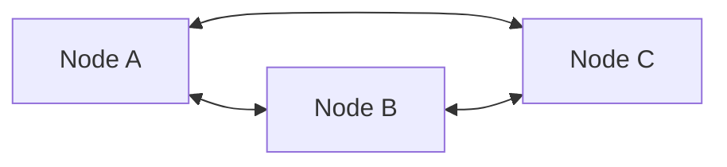
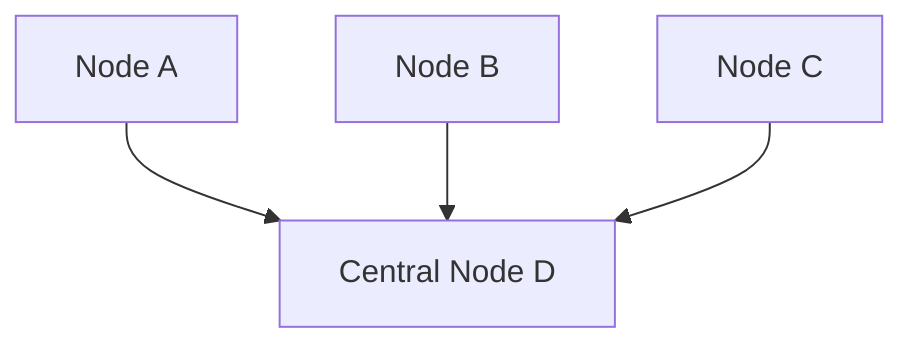
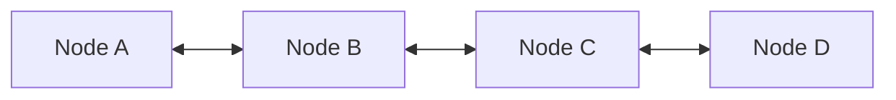

# Group Network Configuration Guide

This guide explains how to use the group network configuration feature to simplify complex WireGuard topology definitions.

## Table of Contents
- [Basic Concepts](#basic-concepts)
- [Configuration Structure](#configuration-structure)
- [Topology Types](#topology-types)
- [Real-World Examples](#real-world-examples)
- [Advanced Features](#advanced-features)

## Basic Concepts

The group network configuration allows you to:
1. Define nodes in logical groups (e.g., office, campus, cloud)
2. Specify relationships between groups with simple topology types
3. Automatically generate all required peer configurations
4. Handle complex routing scenarios with ease

## Configuration Structure

A group configuration file has three main sections:

```yaml
# 1. Nodes section - Define all nodes organized by groups
nodes:
  group_name:
    - name: node_name
      wireguard_ip: IP_address
      endpoints:
        endpoint_name: address:port
      # Optional fields
      role: client|relay
      enable_ip_forward: true|false

# 2. Groups section - Define how nodes within/between groups connect
groups:
  - name: group_name
    nodes: [node1, node2, ...]
    topology: mesh|star|chain|single
    # Optional fields
    mesh_endpoint: endpoint_name  # Which endpoint to use for mesh connections

# 3. Routing section (optional) - Define custom routing rules
routing:
  node_allowed_ips:
    - subnet1
    - subnet2
```

## Topology Types

### 1. Mesh Topology
All nodes in the group connect to each other.

```yaml
groups:
  - name: office
    nodes: [A, B, C]
    topology: mesh
```

This creates connections:
- A ↔ B
- A ↔ C  
- B ↔ C



### 2. Star Topology
All nodes connect to a central node.

```yaml
groups:
  - name: branch_to_hq
    from: [A, B, C]
    to: D
    type: star
```

This creates connections:
- A → D
- B → D
- C → D



### 3. Chain Topology
Nodes connect in sequence.

```yaml
groups:
  - name: relay_chain
    nodes: [A, B, C, D]
    topology: chain
```

This creates connections:
- A ↔ B
- B ↔ C
- C ↔ D



### 4. Single Topology
Direct connection between specific nodes.

```yaml
groups:
  - name: direct_link
    from: A
    to: B
    type: single
```

This creates connection:
- A ↔ B

## Real-World Examples

### Example 1: Office Network with Internet Gateway

```yaml
nodes:
  office:
    - name: desktop1
      wireguard_ip: 10.0.1.10/24
      endpoints:
        lan: 192.168.1.10:51820
    - name: desktop2
      wireguard_ip: 10.0.1.11/24
      endpoints:
        lan: 192.168.1.11:51820
    - name: laptop1
      wireguard_ip: 10.0.1.20/24
      endpoints:
        lan: 192.168.1.20:51820
        
  gateway:
    - name: gw
      wireguard_ip: 10.0.1.1/24
      role: relay
      enable_ip_forward: true
      endpoints:
        lan: 192.168.1.1:51820
        public: 203.0.113.1:51820

groups:
  # Office devices mesh together
  - name: office_mesh
    nodes: [desktop1, desktop2, laptop1]
    topology: mesh
    mesh_endpoint: lan
    
  # All office devices connect to gateway
  - name: office_to_gateway
    from: office
    to: gw
    type: star

routing:
  # Gateway can access entire subnet
  gw_allowed_ips:
    - 10.0.1.0/24
  # Office devices route internet through gateway  
  office_allowed_ips:
    - 10.0.1.1/32
    - 0.0.0.0/0  # Internet via gateway
```

### Example 2: Multi-Site Corporate Network

```yaml
nodes:
  beijing:
    - name: bj-server1
      wireguard_ip: 10.1.0.10/16
      endpoints:
        internal: 172.16.1.10:51820
    - name: bj-server2
      wireguard_ip: 10.1.0.11/16
      endpoints:
        internal: 172.16.1.11:51820
        
  shanghai:
    - name: sh-server1
      wireguard_ip: 10.2.0.10/16
      endpoints:
        internal: 172.17.1.10:51820
    - name: sh-server2
      wireguard_ip: 10.2.0.11/16
      endpoints:
        internal: 172.17.1.11:51820
        
  relays:
    - name: relay-bj
      wireguard_ip: 10.0.1.1/16
      role: relay
      enable_ip_forward: true
      endpoints:
        public: 114.114.1.1:51820
    - name: relay-sh
      wireguard_ip: 10.0.2.1/16
      role: relay
      enable_ip_forward: true
      endpoints:
        public: 223.223.1.1:51820

groups:
  # Each site meshes internally
  - name: beijing_mesh
    nodes: [bj-server1, bj-server2]
    topology: mesh
    mesh_endpoint: internal
    
  - name: shanghai_mesh
    nodes: [sh-server1, sh-server2]
    topology: mesh
    mesh_endpoint: internal
    
  # Sites connect to their local relay
  - name: beijing_to_relay
    from: beijing
    to: relay-bj
    type: star
    
  - name: shanghai_to_relay
    from: shanghai
    to: relay-sh
    type: star
    
  # Relays mesh together
  - name: relay_mesh
    nodes: [relay-bj, relay-sh]
    topology: mesh

routing:
  relay-bj_allowed_ips:
    - 10.1.0.0/24  # Beijing subnet
    - 10.2.0.0/24  # Shanghai subnet (via relay-sh)
  relay-sh_allowed_ips:
    - 10.2.0.0/24  # Shanghai subnet
    - 10.1.0.0/24  # Beijing subnet (via relay-bj)
```

### Example 3: Cross-Border Network with GFW Considerations

```yaml
nodes:
  china:
    - name: cn-office1
      wireguard_ip: 10.96.0.10/16
      endpoints:
        internal: 192.168.1.10:51820
    - name: cn-office2
      wireguard_ip: 10.96.0.11/16
      endpoints:
        internal: 192.168.1.11:51820
        
  hongkong:
    - name: hk-relay
      wireguard_ip: 10.96.1.1/16
      role: relay
      enable_ip_forward: true
      endpoints:
        public: 45.45.45.45:51820  # Accessible from mainland
        
  overseas:
    - name: us-server
      wireguard_ip: 10.96.2.10/16
      endpoints:
        public: 1.2.3.4:51820
    - name: eu-server
      wireguard_ip: 10.96.3.10/16
      endpoints:
        public: 5.6.7.8:51820

groups:
  # China offices mesh internally
  - name: china_mesh
    nodes: [cn-office1, cn-office2]
    topology: mesh
    mesh_endpoint: internal
    
  # China can only connect to HK relay (GFW restriction)
  - name: china_to_hk
    from: china
    to: hk-relay
    type: star
    
  # HK relay connects to overseas servers
  - name: hk_to_overseas
    from: hk-relay
    to: [us-server, eu-server]
    type: star

routing:
  # HK relay routes between China and overseas
  hk-relay_allowed_ips:
    - 10.96.0.0/24  # China subnet
    - 10.96.2.0/24  # US subnet
    - 10.96.3.0/24  # EU subnet
    
  # China routes overseas traffic through HK
  china_allowed_ips:
    - 10.96.1.1/32  # HK relay
    - 10.96.2.0/24  # US subnet (via HK)
    - 10.96.3.0/24  # EU subnet (via HK)
```

## Advanced Features

### 1. Multiple Endpoints
Nodes can have multiple endpoints for different purposes:

```yaml
nodes:
  multi_endpoint:
    - name: server1
      wireguard_ip: 10.0.0.1/24
      endpoints:
        internal: 192.168.1.10:51820  # For LAN connections
        public: 203.0.113.10:51821     # For WAN connections
        management: 10.10.10.10:51822  # For management network
```

### 2. Endpoint Selection for Groups
Specify which endpoint to use for specific group connections:

```yaml
groups:
  - name: internal_mesh
    nodes: [server1, server2, server3]
    topology: mesh
    mesh_endpoint: internal  # Use 'internal' endpoint for mesh
    
  - name: public_access
    from: [client1, client2]
    to: server1
    type: star
    endpoint: public  # Clients use 'public' endpoint
```

### 3. Custom Routing Rules
Define complex routing scenarios:

```yaml
routing:
  # Pattern: {node_name}_allowed_ips
  gateway_allowed_ips:
    - 10.0.0.0/8     # All private networks
    - 172.16.0.0/12
    - 192.168.0.0/16
    
  # Pattern: {group_name}_allowed_ips  
  office_allowed_ips:
    - 10.0.1.1/32    # Gateway IP
    - 0.0.0.0/0      # Default route through gateway
```

### 4. PostUp/PostDown Scripts
The system automatically generates PostUp/PostDown scripts for relay nodes:

```bash
# Generated for relay nodes with enable_ip_forward: true
PostUp = sysctl -w net.ipv4.ip_forward=1
PostUp = sysctl -w net.ipv6.conf.all.forwarding=1
PostDown = sysctl -w net.ipv4.ip_forward=0
PostDown = sysctl -w net.ipv6.conf.all.forwarding=0
```

## Converting Group Config to Traditional Format

You can convert a group configuration to traditional nodes/topology format:

```bash
python -m wg_mesh_gen.cli convert-group \
    --group-config group_network.yaml \
    --output-nodes nodes_generated.yaml \
    --output-topology topology_generated.yaml
```

This is useful for:
- Understanding what configurations are generated
- Debugging complex topologies
- Migrating to traditional format if needed

## Best Practices

1. **Use Descriptive Group Names**: Choose names that reflect the logical organization (e.g., `beijing_office`, `aws_vpc`, `customer_sites`)

2. **Separate Internal and External Endpoints**: Use different endpoints for LAN and WAN connections to optimize routing

3. **Plan IP Addressing**: Use consistent subnetting:
   - `/24` for site subnets (e.g., 10.1.0.0/24 for Site 1)
   - `/32` for specific host routes
   - `/16` for the overall VPN network

4. **Minimize Routing Overlaps**: Be specific with AllowedIPs to avoid routing conflicts

5. **Document Your Configuration**: Add comments to explain the purpose of each group and routing rule

## Troubleshooting

### Common Issues

1. **"Schema validation failed"**
   - Check YAML syntax
   - Ensure all referenced nodes exist in the nodes section
   - Verify group definitions have required fields

2. **"Routing conflicts"**
   - Review AllowedIPs for overlaps
   - Use more specific subnets
   - Check relay node configurations

3. **"Connection timeouts"**
   - Verify endpoints are reachable
   - Check firewall rules
   - Ensure correct endpoint is used for the network path

### Debugging Tools

```bash
# Validate your group configuration
python -m wg_mesh_gen.cli valid --group-config your_config.yaml

# Visualize the network topology
python -m wg_mesh_gen.cli vis --group-config your_config.yaml --output topology.png

# Simulate the network
python -m wg_mesh_gen.cli simulate --group-config your_config.yaml --test-connectivity
```