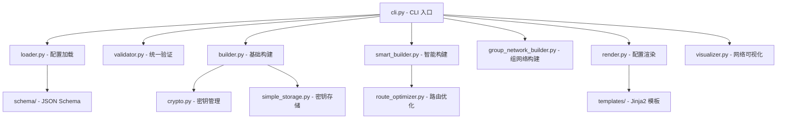

# WireGuard 配置生成器技术架构文档

## 📖 文档概述

本文档详细分析 WireGuard Mesh 配置生成器的技术架构、配置逻辑、节点角色系统和网络生成流程，旨在为技术讨论、架构设计和系统扩展提供完整的技术参考。

---

## 🏗️ 系统架构概览

### 核心设计原则

1. **模块化架构** - 每个组件职责单一，便于测试和维护
2. **配置驱动** - 基于 YAML/JSON 配置文件和 JSON Schema 验证
3. **灵活拓扑** - 支持从简单点对点到复杂企业级网络的多种拓扑
4. **智能优化** - 内置路由优化和网络性能分析
5. **模板化输出** - 使用 Jinja2 模板生成 WireGuard 配置和脚本

### 模块依赖关系



### 三种配置模式对比

| 配置模式 | 配置文件 | 适用场景 | 特性 |
|----------|----------|----------|------|
| **简单模式** | `nodes.yaml` + `topology.yaml` | 小型网络、学习演示 | 直接定义连接，精确控制 |
| **组网络模式** | `group_network.yaml` | 企业网络、复杂拓扑 | 分组管理，多种拓扑类型 |
| **智能模式** | 任意 + `--optimize` | 大型网络、性能优化 | 路由优化，性能分析 |

---

## 👥 节点角色系统深度分析

### 当前角色定义

#### 1. Client 角色
```yaml
- name: user-laptop
  role: client
  wireguard_ip: 10.96.0.2/16
```

**特征：**
- 默认角色，适用于终端设备
- 不启用 IP 转发 (`ip_forward = false`)
- 通常作为网络的叶子节点
- 主要用于接收和发送自身流量

**技术实现：**
```python
# loader.py:39-41
if 'role' not in node:
    logger.warning(f"节点 {node['name']} 缺少 'role' 字段，默认设为 'client'")
    node['role'] = 'client'
```

#### 2. Relay 角色
```yaml
- name: central-server
  role: relay
  wireguard_ip: 10.96.0.1/16
```

**特征：**
- 中继节点，具备流量转发能力
- 自动启用 IP 转发 (`enable_ip_forward = true`)
- 在路由优化中被识别为关键节点
- 适用于云服务器、专用设备

**技术实现：**
```python
# gui/models/node.py:92-94
if value == "relay" and hasattr(self, '_enable_ip_forward'):
    self._enable_ip_forward = True
```

#### 3. Server 角色
```yaml
- name: gateway-server
  role: server
  wireguard_ip: 10.96.0.1/16
```

**特征：**
- 服务器节点，通常具有固定公网 IP
- 作为网络拓扑中的枢纽节点
- 支持但未充分利用（Schema 中定义但代码中较少特殊处理）

### 角色系统的影响范围

#### 1. 路由优化 (`route_optimizer.py`)
```python
def get_relay_nodes(self) -> List[str]:
    """获取所有中继节点"""
    relay_nodes = []
    for node in self.nodes:
        if node.get('role') == 'relay':
            relay_nodes.append(node['name'])
    return relay_nodes
```

#### 2. 可视化表示 (`visualizer.py`)
```python
# 根据角色设置不同的图标和颜色
icon = 'router' if node.role == 'relay' else 'computer'
'color': '#4CAF50' if node.role == 'relay' else '#2196F3'
```

#### 3. 网络分析 (`smart_builder.py`)
```python
'client_nodes': [n['name'] for n in self.nodes if n.get('role') == 'client']
```

### 角色系统的局限性

1. **功能重叠** - Relay 角色承担了过多职责
2. **粒度不足** - 无法区分不同类型的中继（区域中继 vs 全局中继）  
3. **缺乏专业角色** - 没有网关、监控、桥接等专门角色
4. **扩展性限制** - 新增角色需要修改多个模块

### 建议的角色扩展

```yaml
# 建议的完整角色体系
roles:
  # 基础角色
  client: "终端节点，不转发流量"
  relay: "基础中继节点"
  
  # 扩展角色  
  gateway: "网络边界节点，连接外部网络"
  hub: "星型拓扑中心，支持大量客户端"
  monitor: "监控节点，收集网络状态"
  bridge: "桥接节点，连接不同子网"
  
  # Mesh 角色
  mesh_full: "全网格节点，与所有节点连接"
  mesh_partial: "部分网格节点，选择性连接"
  mesh_edge: "边缘网格节点，有限连接"
```

---

## 📄 配置文件完整解析

### 1. nodes.yaml - 节点配置文件

#### Schema 定义
```json
{
  "required": ["name", "role", "wireguard_ip"],
  "properties": {
    "name": {"pattern": "^[a-zA-Z0-9_-]+$"},
    "role": {"enum": ["client", "relay", "server"]},
    "wireguard_ip": {"pattern": "^(?:[0-9]{1,3}\\.){3}[0-9]{1,3}/[0-9]{1,2}$"}
  }
}
```

#### 完整配置示例
```yaml
nodes:
  # 客户端节点
  - name: laptop-office
    role: client
    wireguard_ip: 10.96.0.2/16
    listen_port: 51820                    # 监听端口
    endpoints:                            # 多端点支持
      - 192.168.1.10:51820               # 内网端点
      - 203.0.113.10:51821               # 公网端点
    dns: [8.8.8.8, 1.1.1.1]             # DNS 服务器
    mtu: 1420                            # 最大传输单元
    
  # 中继节点
  - name: relay-server
    role: relay
    wireguard_ip: 10.96.0.1/16
    endpoints:
      - 203.0.113.5:51820
      - 203.0.113.5:51821
    # 中继节点自动启用 IP 转发
```

#### 字段详解

| 字段 | 必需 | 类型 | 说明 | 示例 |
|------|------|------|------|------|
| `name` | ✅ | string | 节点唯一标识符 | `office-laptop` |
| `role` | ✅ | enum | 节点角色 | `client`/`relay`/`server` |
| `wireguard_ip` | ✅ | string | WireGuard IP 地址 | `10.96.0.2/16` |
| `listen_port` | ❌ | integer | UDP 监听端口 | `51820` |
| `endpoints` | ❌ | array | 公网访问端点 | `["host:port"]` |
| `dns` | ❌ | array | DNS 服务器 | `["8.8.8.8"]` |
| `mtu` | ❌ | integer | 最大传输单元 | `1420` |
| `private_key` | ❌ | string | WireGuard 私钥 | base64 编码 |
| `public_key` | ❌ | string | WireGuard 公钥 | base64 编码 |
| `psk` | ❌ | string | 预共享密钥 | base64 编码 |

### 2. topology.yaml - 拓扑配置文件

#### Schema 定义
```json
{
  "required": ["from", "to"],
  "properties": {
    "from": {"pattern": "^[a-zA-Z0-9_-]+$"},
    "to": {"pattern": "^[a-zA-Z0-9_-]+$"},
    "endpoint": {"pattern": "^[^:]+:[0-9]+$"},
    "allowed_ips": {"items": {"pattern": "^(?:[0-9]{1,3}\\.){3}[0-9]{1,3}(?:/[0-9]{1,2})?$"}}
  }
}
```

#### 配置示例和设计原理
```yaml
peers:
  # 组内 mesh 连接示例
  - from: A
    to: B
    endpoint: group                       # 使用节点 B 的 "group" 端点
    allowed_ips:
      - 10.96.0.3/32                     # 只允许访问节点 B 的 IP
      
  # 中继连接示例  
  - from: A
    to: relay-server
    endpoint: clients                     # 使用中继服务器的 "clients" 端点
    allowed_ips:
      - 10.96.0.0/22                     # 允许访问整个网络段
      
  # 特殊端点示例
  - from: china-client
    to: overseas-server
    endpoint: special                     # 使用特殊隧道端点
    allowed_ips:
      - 0.0.0.0/0                        # 全流量路由
    persistent_keepalive: 25             # 保持连接活跃
```

#### 关键设计决策

1. **单向连接原则**
   ```python
   # builder.py 不自动创建反向连接
   # 必须在配置中明确定义每个方向的连接
   ```

2. **端点解析机制**
   ```python
   # 端点解析优先级：
   # 1. 明确指定的端点地址 (host:port)
   # 2. 端点标识符 (group/clients/peers)
   # 3. 目标节点的第一个端点
   ```

3. **AllowedIPs 方向性**
   ```yaml
   # A -> B 的 allowed_ips 定义 A 可以通过 B 访问的网络
   # B -> A 的 allowed_ips 定义 B 可以通过 A 访问的网络
   ```

### 3. group_network.yaml - 高级组网络配置

#### 配置结构层次
```yaml
network_topology:
  groups:                                # 网络分组
    office:                              # 组名
      nodes: {}                          # 组内节点
      topology: mesh                     # 组内拓扑
    data_center:
      nodes: {}
      topology: star
      hub_node: central-server           # 星型拓扑的中心节点
      
  connections:                           # 组间连接
    - name: office_to_datacenter
      from: office
      to: data_center  
      type: gateway                      # 连接类型
      routing: {}                        # 路由配置
```

#### 支持的拓扑类型

| 拓扑类型 | 描述 | 连接模式 | 适用场景 |
|----------|------|----------|----------|
| `mesh` | 全连接网格 | 每个节点连接其他所有节点 | 小型团队，高可靠性 |
| `star` | 星型拓扑 | 所有节点连接到中心节点 | 大量客户端，集中管理 |
| `chain` | 链式拓扑 | 节点顺序连接成链 | 级联连接，简单路由 |
| `single` | 单节点组 | 组内无连接 | 独立节点，外部连接 |

#### 连接类型详解

| 连接类型 | 方向性 | 用途 | 配置示例 |
|----------|--------|------|----------|
| `outbound_only` | 单向 | 客户端访问服务器 | 办公室访问数据中心 |
| `bidirectional` | 双向 | 对等网络互联 | 分支机构互联 |
| `gateway` | 通过网关 | 通过特定节点中转 | 通过 VPN 网关访问 |
| `selective` | 选择性 | 部分节点参与连接 | 特定服务器提供服务 |
| `full_mesh` | 全互联 | 组间所有节点互联 | 高可用集群 |

#### 实际配置示例：跨境网络

```yaml
network_topology:
  groups:
    china_office:
      description: "中国办公室"
      nodes:
        laptop1: {ip: "10.96.1.2/24"}
        laptop2: {ip: "10.96.1.3/24"}
      topology: mesh
      
    china_relay:
      description: "中国中继服务器"
      nodes:
        relay_cn: 
          ip: "10.96.100.1/24"
          endpoints:
            public: "china.example.com:51820"
            special: "172.16.0.1:22222"      # 特殊隧道端点
      topology: single
      
    overseas_servers:
      description: "海外服务器集群"  
      nodes:
        server_us1:
          ip: "10.96.200.2/24"
          endpoints:
            public: "us1.example.com:51820"
            special: "172.16.1.1:33333"     # 特殊隧道端点
        server_us2: {ip: "10.96.200.3/24"}
      topology: mesh
      
  connections:
    # 办公室到中继的连接
    - name: office_to_relay
      from: china_office
      to: china_relay
      type: outbound_only
      endpoint_selector: public
      routing:
        allowed_ips: ["china_relay.nodes", "overseas_servers.subnet"]
        
    # 中继到海外的特殊桥接
    - name: china_overseas_bridge  
      from: china_relay.relay_cn
      to: overseas_servers.server_us1
      type: bidirectional
      endpoint_mapping:
        relay_cn_to_server_us1: "server_us1.special"
        server_us1_to_relay_cn: "relay_cn.special"
      special_flags:
        is_bridge: true
        persistent_keepalive: 25
      routing:
        relay_cn_allowed_ips: ["overseas_servers.subnet"]
        server_us1_allowed_ips: ["china_office.subnet", "china_relay.nodes"]
```

---

## ⚙️ 网络生成流程详解

### Phase 1: 配置加载和验证管道

#### 1.1 配置文件加载 (`loader.py`)
```python
def load_nodes(file_path: str) -> List[Dict[str, Any]]:
    """加载节点配置，处理默认值"""
    # 1. 解析 YAML/JSON 文件
    # 2. 为缺失角色的节点设置默认值 'client'
    # 3. 返回标准化的节点列表
```

#### 1.2 JSON Schema 验证 (`validator.py`)
```python
def validate_schema(data: Dict, schema_name: str):
    """基于 JSON Schema 验证配置结构"""
    # 1. 加载对应的 schema 文件
    # 2. 使用 jsonschema 库进行验证
    # 3. 报告详细的验证错误
```

#### 1.3 业务逻辑验证
```python
def validate_business_logic(nodes: List, peers: List) -> bool:
    """验证业务规则"""
    # 1. 节点名称唯一性检查
    # 2. 对等连接引用完整性验证
    # 3. WireGuard IP 地址唯一性检查
    # 4. 端点格式验证
    # 5. 网络连通性分析（BFS 算法）
```

### Phase 2: 密钥管理和存储策略

#### 2.1 密钥存储设计 (`simple_storage.py`)
```python
class SimpleKeyStorage:
    """基于 JSON 文件的密钥存储"""
    def __init__(self, db_path: str):
        self.db_path = db_path
        self.lock = FileLock(f"{db_path}.lock")  # 文件锁防止并发
        
    def store_keypair(self, name: str, private_key: str, public_key: str):
        """存储密钥对"""
        with self.lock:
            # 原子性写入，避免数据损坏
```

#### 2.2 密钥生成策略
```python
def auto_generate_keys(nodes: List, key_storage: SimpleKeyStorage):
    """自动密钥生成策略"""
    for node in nodes:
        existing_keys = key_storage.get_keypair(node['name'])
        if not existing_keys:
            # 只为缺失密钥的节点生成新密钥
            private_key, public_key = generate_keypair()
            key_storage.store_keypair(node['name'], private_key, public_key)
```

### Phase 3: 拓扑构建和对等连接映射

#### 3.1 对等连接映射构建 (`builder.py`)
```python
def _build_peer_map(peers: List) -> Dict[str, List]:
    """构建对等连接映射，避免重复连接"""
    peer_map = {}
    for peer in peers:
        from_node = peer['from']
        if from_node not in peer_map:
            peer_map[from_node] = []
        peer_map[from_node].append({
            'node': peer['to'],
            'direction': 'outgoing',
            'endpoint': peer.get('endpoint'),
            'allowed_ips': peer.get('allowed_ips', []),
            'persistent_keepalive': peer.get('persistent_keepalive')
        })
    return peer_map
```

#### 3.2 节点配置构建
```python
def _build_node_config_optimized(node, nodes, peer_map):
    """为单个节点构建完整配置"""
    config = {
        'interface': {
            'private_key': get_node_private_key(node),
            'address': node['wireguard_ip'],
            'listen_port': extract_listen_port(node),
            'dns': node.get('dns', []),
            'mtu': node.get('mtu', 1420)
        },
        'peers': []
    }
    
    # 为该节点的每个对等连接构建 peer 配置
    node_peers = peer_map.get(node['name'], [])
    for peer_conn in node_peers:
        peer_config = build_peer_config(peer_conn, nodes)
        config['peers'].append(peer_config)
        
    return config
```

#### 3.3 端点解析机制
```python
def resolve_endpoint(peer_conn, target_node):
    """端点解析优先级"""
    endpoint = peer_conn.get('endpoint')
    
    if endpoint and ':' in endpoint:
        # 1. 直接指定的端点地址
        return endpoint
    elif endpoint and target_node.get('endpoints'):
        # 2. 端点标识符解析
        if isinstance(target_node['endpoints'], dict):
            return target_node['endpoints'].get(endpoint)
        elif isinstance(target_node['endpoints'], list):
            return target_node['endpoints'][0]
    elif target_node.get('endpoints'):
        # 3. 使用目标节点的第一个端点
        endpoints = target_node['endpoints']
        return endpoints[0] if isinstance(endpoints, list) else list(endpoints.values())[0]
    
    return None
```

### Phase 4: 智能路由优化 (可选)

#### 4.1 网络性能分析 (`route_optimizer.py`)
```python
class RouteOptimizer:
    def analyze_network_performance(self) -> Dict[str, Any]:
        """分析网络性能指标"""
        G = self._build_network_graph()
        
        metrics = {
            'node_count': len(self.nodes),
            'edge_count': len(self.peers),
            'relay_count': len(self.get_relay_nodes()),
            'average_path_length': nx.average_shortest_path_length(G),
            'network_diameter': nx.diameter(G),
            'clustering_coefficient': nx.average_clustering(G),
            'connectivity': nx.is_connected(G)
        }
        return metrics
```

#### 4.2 路由优化算法
```python
def optimize_mesh_routes(self) -> Dict[str, Dict[str, List[str]]]:
    """优化网络路由"""
    optimized_routes = {}
    G = self._build_network_graph()
    
    for source in self.get_all_nodes():
        optimized_routes[source] = {}
        for target in self.get_all_nodes():
            if source != target:
                # 计算最短路径
                try:
                    shortest_path = nx.shortest_path(G, source, target)
                    optimized_routes[source][target] = shortest_path
                except nx.NetworkXNoPath:
                    # 处理不连通的情况
                    optimized_routes[source][target] = []
                    
    return optimized_routes
```

#### 4.3 瓶颈检测
```python
def detect_bottlenecks(self) -> List[Tuple[str, str]]:
    """检测网络瓶颈"""
    G = self._build_network_graph()
    bottlenecks = []
    
    # 计算边的中介中心性
    edge_betweenness = nx.edge_betweenness_centrality(G)
    
    # 识别高中介中心性的边作为潜在瓶颈
    threshold = 0.1
    for edge, centrality in edge_betweenness.items():
        if centrality > threshold:
            bottlenecks.append(edge)
            
    return bottlenecks
```

### Phase 5: 配置渲染和模板系统

#### 5.1 模板系统设计 (`render.py`)
```python
class ConfigRenderer:
    def __init__(self, template_dir: str = None):
        """初始化 Jinja2 模板环境"""
        template_dir = template_dir or self._get_default_template_dir()
        self.env = jinja2.Environment(
            loader=jinja2.FileSystemLoader(template_dir),
            trim_blocks=True,
            lstrip_blocks=True
        )
```

#### 5.2 WireGuard 配置模板 (`templates/interface.conf.j2`)
```jinja2
[Interface]
PrivateKey = {{ interface.private_key }}
Address = {{ interface.address }}

ListenPort = {{ interface.listen_port }}


DNS = {{ interface.dns | join(', ') }}


MTU = {{ interface.mtu }}



[Peer]
PublicKey = {{ peer.public_key }}

PresharedKey = {{ peer.preshared_key }}


Endpoint = {{ peer.endpoint }}

AllowedIPs = {{ peer.allowed_ips | join(', ') }}

PersistentKeepalive = {{ peer.persistent_keepalive }}



```

#### 5.3 设置脚本模板 (`templates/wg-quick.sh.j2`)
```bash
#!/bin/bash
# WireGuard 配置脚本 for {{ node_name }}

set -e

CONFIG_FILE="/etc/wireguard/{{ node_name }}.conf"
INTERFACE="wg-{{ node_name }}"

case "$1" in
    up)
        echo "启动 WireGuard 接口: $INTERFACE"
        wg-quick up "$CONFIG_FILE"
        ;;
    down)  
        echo "关闭 WireGuard 接口: $INTERFACE"
        wg-quick down "$CONFIG_FILE"
        ;;
    restart)
        $0 down
        $0 up
        ;;
    *)
        echo "用法: $0 {up|down|restart}"
        exit 1
        ;;
esac
```

#### 5.4 渲染流程
```python
def render_all_configs(self, configs: Dict, output_dir: str):
    """渲染所有节点的配置"""
    os.makedirs(output_dir, exist_ok=True)
    
    for node_name, config in configs.items():
        # 渲染 WireGuard 配置文件
        self.render_config(node_name, config, output_dir)
        
        # 渲染设置脚本
        self.render_script(node_name, config, output_dir)
        
        logger.info(f"已生成节点 {node_name} 的配置文件")
```

---

## 🔧 核心技术实现

### 1. 单向连接设计原理

#### 设计动机
```python
# 传统双向连接的问题：
# 1. 自动创建的反向连接可能不符合实际需求
# 2. AllowedIPs 在两个方向上可能需要不同配置
# 3. 端点配置在双向连接中可能不对称
```

#### 实现机制
```python
def _build_peer_map(peers):
    """严格按照配置构建连接，不自动创建反向连接"""
    peer_map = {}
    for peer in peers:
        from_node = peer['from']
        # 只为 from_node 添加到 to_node 的连接
        # 反向连接必须在配置中明确定义
```

#### 优势
- **精确控制** - 每个连接的配置都是明确的
- **灵活路由** - 支持不对称的路由配置
- **安全性** - 避免意外的网络访问路径

### 2. 多端点支持机制

#### 端点配置格式
```yaml
# 方式1：数组格式（向后兼容）
endpoints:
  - 192.168.1.10:51820
  - 203.0.113.10:51821

# 方式2：命名端点（推荐）
endpoints:
  internal: 192.168.1.10:51820
  public: 203.0.113.10:51821
  mesh: 192.168.1.10:51822
  special: 172.16.0.1:22222
```

#### 端点选择策略
```python
def select_endpoint(target_node, endpoint_selector):
    """智能端点选择"""
    endpoints = target_node.get('endpoints', [])
    
    if isinstance(endpoints, dict):
        # 命名端点选择
        return endpoints.get(endpoint_selector) or list(endpoints.values())[0]
    elif isinstance(endpoints, list):
        # 数组端点选择（使用第一个）
        return endpoints[0] if endpoints else None
```

#### 应用场景
- **内外网分离** - 内网用内网端点，外网用公网端点
- **专用通道** - 为特殊连接使用专用端口或混淆端点
- **负载均衡** - 不同端点分担不同类型的连接

### 3. 路由优化算法

#### 基于 NetworkX 的图分析
```python
def _build_network_graph(self) -> nx.Graph:
    """构建网络拓扑图"""
    G = nx.Graph()
    
    # 添加节点
    for node in self.nodes:
        G.add_node(node['name'], **node)
    
    # 添加边
    for peer in self.peers:
        G.add_edge(peer['from'], peer['to'], **peer)
        
    return G
```

#### 最短路径计算
```python
def find_optimal_routes(self):
    """找出所有节点对的最优路径"""
    G = self._build_network_graph()
    routes = {}
    
    for source in G.nodes():
        routes[source] = {}
        for target in G.nodes():
            if source != target:
                try:
                    path = nx.shortest_path(G, source, target)
                    routes[source][target] = path
                except nx.NetworkXNoPath:
                    routes[source][target] = None
                    
    return routes
```

#### 中继节点建议
```python
def suggest_relay_placement(self, max_relays: int = 3):
    """基于中介中心性建议中继节点位置"""
    G = self._build_network_graph()
    
    # 计算节点的中介中心性
    centrality = nx.betweenness_centrality(G)
    
    # 选择中心性最高的节点作为建议的中继位置
    suggested_relays = sorted(centrality.items(), 
                            key=lambda x: x[1], reverse=True)[:max_relays]
    
    return [node for node, _ in suggested_relays]
```

### 4. 模板系统 (Jinja2)

#### 模板继承结构
```jinja2
{# base.conf.j2 - 基础模板 #}
[Interface]
PrivateKey = {{ interface.private_key }}
Address = {{ interface.address }}




[Peer]

PublicKey = {{ peer.public_key }}

Endpoint = {{ peer.endpoint }}

AllowedIPs = {{ peer.allowed_ips | join(', ') }}



```

#### 自定义过滤器
```python
def register_custom_filters(env: jinja2.Environment):
    """注册自定义模板过滤器"""
    
    @env.filter
    def format_allowed_ips(ip_list):
        """格式化 AllowedIPs 列表"""
        if not ip_list:
            return "0.0.0.0/0"
        return ", ".join(ip_list)
    
    @env.filter  
    def mask_private_key(key):
        """遮盖私钥显示"""
        if len(key) > 8:
            return key[:4] + "..." + key[-4:]
        return key
```

### 5. 密钥存储系统

#### JSON 存储格式
```json
{
  "keys": {
    "node_name": {
      "private_key": "base64_encoded_private_key",
      "public_key": "base64_encoded_public_key", 
      "psk": "base64_encoded_preshared_key",
      "created_at": "2024-01-01T00:00:00Z",
      "updated_at": "2024-01-01T00:00:00Z"
    }
  },
  "metadata": {
    "version": "1.0",
    "created_at": "2024-01-01T00:00:00Z"
  }
}
```

#### 并发安全机制
```python
class SimpleKeyStorage:
    def __init__(self, db_path: str):
        self.db_path = db_path
        self.lock = FileLock(f"{db_path}.lock")
        
    def _atomic_write(self, data: Dict):
        """原子性写入，防止数据损坏"""
        temp_path = f"{self.db_path}.tmp"
        with open(temp_path, 'w') as f:
            json.dump(data, f, indent=2)
        os.rename(temp_path, self.db_path)  # 原子性重命名
```

---

## 📚 实战用例集

### 用例1: 家庭办公网络 - 简单星型拓扑

#### 场景描述
家庭办公场景，一台路由器作为中心节点，多台设备（笔记本、手机、平板）连接到中心节点。

#### 配置示例
```yaml
# nodes.yaml
nodes:
  - name: home-router
    role: relay
    wireguard_ip: 10.0.0.1/24
    endpoints:
      - 203.0.113.100:51820
    
  - name: laptop
    role: client  
    wireguard_ip: 10.0.0.2/24
    
  - name: phone
    role: client
    wireguard_ip: 10.0.0.3/24
    
  - name: tablet
    role: client
    wireguard_ip: 10.0.0.4/24

# topology.yaml
peers:
  # 所有设备连接到中心路由器
  - from: laptop
    to: home-router
    allowed_ips: [10.0.0.0/24]
    
  - from: phone  
    to: home-router
    allowed_ips: [10.0.0.0/24]
    
  - from: tablet
    to: home-router
    allowed_ips: [10.0.0.0/24]
```

#### 生成命令
```bash
python -m wg_mesh_gen.cli gen \
  --nodes-file examples/home_nodes.yaml \
  --topo-file examples/home_topology.yaml \
  --output-dir out/home-network
```

### 用例2: 企业分支网络 - 多层级 Mesh 网络

#### 场景描述
企业总部和多个分支机构的网络互联，总部有多台服务器组成 mesh 网络，各分支机构通过专用中继节点连接。

#### 组网络配置
```yaml
network_topology:
  groups:
    headquarters:
      description: "企业总部服务器集群"
      nodes:
        hq-server1: {ip: "10.100.1.2/24"}
        hq-server2: {ip: "10.100.1.3/24"}  
        hq-server3: {ip: "10.100.1.4/24"}
      topology: mesh
      
    branch-beijing:
      description: "北京分支机构"
      nodes:
        bj-gateway: {ip: "10.100.10.1/24", endpoints: {public: "beijing.company.com:51820"}}
        bj-office1: {ip: "10.100.10.2/24"}
        bj-office2: {ip: "10.100.10.3/24"}
      topology: star
      hub_node: bj-gateway
      
    branch-shanghai:
      description: "上海分支机构"  
      nodes:
        sh-gateway: {ip: "10.100.20.1/24", endpoints: {public: "shanghai.company.com:51820"}}
        sh-office1: {ip: "10.100.20.2/24"}
        sh-office2: {ip: "10.100.20.3/24"}
      topology: star
      hub_node: sh-gateway
      
  connections:
    # 分支机构到总部的连接
    - name: beijing_to_hq
      from: branch-beijing.bj-gateway
      to: headquarters
      type: gateway
      gateway_nodes: {to: [hq-server1]}
      routing:
        allowed_ips: ["headquarters.subnet"]
        
    - name: shanghai_to_hq
      from: branch-shanghai.sh-gateway  
      to: headquarters
      type: gateway
      gateway_nodes: {to: [hq-server2]}
      routing:
        allowed_ips: ["headquarters.subnet"]
        
    # 分支机构间的互联
    - name: inter_branch
      from: branch-beijing.bj-gateway
      to: branch-shanghai.sh-gateway
      type: bidirectional
      routing:
        allowed_ips: 
          - "branch-beijing.subnet"
          - "branch-shanghai.subnet"
```

### 用例3: 跨境网络 - 中继节点和特殊端点

#### 场景描述
国内办公室需要访问海外服务器，由于网络限制，需要通过国内中继服务器和特殊隧道技术进行连接。

#### 详细配置
```yaml
network_topology:
  groups:
    china_office:
      description: "国内办公室网络"
      nodes:
        office-laptop1:
          ip: "10.96.1.2/24"
          endpoints: {lan: "192.168.1.10:51820"}
        office-laptop2:
          ip: "10.96.1.3/24"  
          endpoints: {lan: "192.168.1.11:51820"}
        office-server:
          ip: "10.96.1.4/24"
          endpoints: {lan: "192.168.1.20:51820"}
      topology: mesh
      
    china_relay:
      description: "国内中继服务器"
      nodes:
        relay-beijing:
          ip: "10.96.100.1/24"
          endpoints:
            public: "relay.china.example.com:51820"
            # 特殊端点：经过协议混淆或端口跳跃的端点
            obfuscated: "172.16.0.1:8080"
      topology: single
      
    overseas_cluster:
      description: "海外服务器集群"
      nodes:
        us-server1:
          ip: "10.96.200.1/24" 
          endpoints:
            public: "us1.example.com:51820"
            # 对应的特殊端点，用于接收混淆流量
            obfuscated: "172.16.1.1:8080"
        us-server2:
          ip: "10.96.200.2/24"
          endpoints: {public: "us2.example.com:51820"}
        eu-server1:
          ip: "10.96.201.1/24"
          endpoints: {public: "eu1.example.com:51820"}
      topology: mesh
      
  connections:
    # 国内办公室到中继服务器
    - name: office_to_relay
      from: china_office
      to: china_relay
      type: outbound_only
      endpoint_selector: public
      routing:
        allowed_ips: 
          - "china_relay.nodes"
          - "overseas_cluster.subnet"      # 通过中继访问海外
          
    # 关键的跨境桥接连接
    - name: china_overseas_bridge
      from: china_relay.relay-beijing
      to: overseas_cluster.us-server1
      type: bidirectional
      endpoint_mapping:
        # 使用特殊混淆端点进行连接
        relay-beijing_to_us-server1: "us-server1.obfuscated"
        us-server1_to_relay-beijing: "relay-beijing.obfuscated"
      special_flags:
        is_bridge: true
        persistent_keepalive: 15          # 更频繁的保活
      routing:
        # 中继服务器的路由：转发办公室流量到海外
        relay-beijing_allowed_ips:
          - "overseas_cluster.subnet"
        # 海外服务器的路由：接受来自国内的流量  
        us-server1_allowed_ips:
          - "china_office.subnet"
          - "china_relay.nodes"
          
    # 海外服务器间的内部互联
    - name: overseas_internal
      from: overseas_cluster
      to: overseas_cluster  
      type: full_mesh
      endpoint_selector: public
      routing:
        allowed_ips: ["overseas_cluster.subnet"]
```

#### 部署说明
```bash
# 1. 生成配置
python -m wg_mesh_gen.cli group-gen \
  --config-file examples/cross_border.yaml \
  --output-dir out/cross-border

# 2. 特殊部署注意事项
echo "部署前请确保："
echo "1. 中继服务器已配置端口混淆或其他规避技术"  
echo "2. 海外服务器的防火墙已开放相应端口"
echo "3. 所有 persistent_keepalive 设置已根据网络条件调优"
```

### 用例4: 高可用集群 - 冗余路径和故障转移

#### 场景描述
关键业务系统，需要多条冗余路径确保高可用性，包括主备中继、多路径路由和自动故障转移。

#### 高可用配置
```yaml
network_topology:
  groups:
    critical_clients:
      description: "关键业务客户端"
      nodes:
        client1: {ip: "10.200.1.2/24"}
        client2: {ip: "10.200.1.3/24"}
      topology: mesh
      
    primary_relays:
      description: "主中继集群"
      nodes:
        relay-primary1:
          ip: "10.200.100.1/24"
          endpoints:
            public: "primary1.ha.example.com:51820"
            backup: "primary1.ha.example.com:51821"
        relay-primary2:  
          ip: "10.200.100.2/24"
          endpoints:
            public: "primary2.ha.example.com:51820"
            backup: "primary2.ha.example.com:51821"
      topology: mesh
      
    backup_relays:
      description: "备用中继集群"
      nodes:
        relay-backup1:
          ip: "10.200.200.1/24"
          endpoints: {public: "backup1.ha.example.com:51820"}
        relay-backup2:
          ip: "10.200.200.2/24"  
          endpoints: {public: "backup2.ha.example.com:51820"}
      topology: mesh
      
    target_servers:
      description: "目标服务器集群"
      nodes:
        server1: {ip: "10.200.10.1/24"}
        server2: {ip: "10.200.10.2/24"}
        server3: {ip: "10.200.10.3/24"}
      topology: mesh
      
  connections:
    # 客户端到主中继的多路径连接
    - name: clients_to_primary_relays  
      from: critical_clients
      to: primary_relays
      type: full_mesh                    # 全连接提供冗余
      endpoint_selector: public
      special_flags:
        persistent_keepalive: 10         # 快速检测连接状态
      routing:
        allowed_ips: 
          - "primary_relays.subnet"
          - "target_servers.subnet"
          
    # 客户端到备用中继的连接  
    - name: clients_to_backup_relays
      from: critical_clients
      to: backup_relays
      type: full_mesh
      endpoint_selector: public
      special_flags:
        persistent_keepalive: 30         # 备用连接可以稍慢
      routing:
        allowed_ips:
          - "backup_relays.subnet" 
          - "target_servers.subnet"
          
    # 主中继到目标服务器
    - name: primary_to_servers
      from: primary_relays
      to: target_servers
      type: full_mesh
      routing:
        allowed_ips: ["target_servers.subnet"]
        
    # 备用中继到目标服务器  
    - name: backup_to_servers
      from: backup_relays
      to: target_servers
      type: full_mesh
      routing:
        allowed_ips: ["target_servers.subnet"]
        
    # 主备中继间的同步连接
    - name: primary_backup_sync
      from: primary_relays
      to: backup_relays
      type: bidirectional
      special_flags:
        persistent_keepalive: 5          # 保持同步状态
      routing:
        allowed_ips:
          - "primary_relays.subnet"
          - "backup_relays.subnet"
```

---

## 🎯 最佳实践指南

### 1. 角色选择建议

#### 选择矩阵
| 节点类型 | 建议角色 | 原因 | 配置要点 |
|----------|----------|------|----------|
| 个人设备（笔记本、手机） | `client` | 不需要转发流量 | 配置最简，安全性高 |
| 家用路由器 | `relay` | 需要为其他设备转发 | 启用 IP 转发，稳定端点 |
| 云服务器 | `relay` 或 `server` | 公网 IP，高可用性 | 多端点，防火墙配置 |
| 企业网关 | `server` | 网络边界，集中管理 | 安全策略，监控日志 |
| 监控节点 | `client` (未来: `monitor`) | 收集网络状态 | 只读访问，数据采集 |

#### 角色规划原则
1. **最小权限原则** - 默认使用 `client`，只在必要时升级为 `relay`
2. **网络分层** - 按照网络层次合理分配角色
3. **故障域隔离** - 避免所有 `relay` 节点在同一故障域
4. **性能考虑** - `relay` 节点需要足够的带宽和处理能力

### 2. 网络分段策略

#### IP 地址规划
```yaml
# 推荐的 IP 地址分配策略
networks:
  management: 10.96.0.0/22      # 管理网络 (10.96.0.1 - 10.96.3.254)
  office: 10.96.4.0/22          # 办公网络 (10.96.4.1 - 10.96.7.254)  
  servers: 10.96.8.0/22         # 服务器网络 (10.96.8.1 - 10.96.11.254)
  dmz: 10.96.12.0/22            # DMZ 网络 (10.96.12.1 - 10.96.15.254)
  guests: 10.96.16.0/22         # 访客网络 (10.96.16.1 - 10.96.19.254)
```

#### AllowedIPs 配置策略
```yaml
# 分层访问控制
allowed_ips_examples:
  # 严格策略：只访问特定节点
  specific_node: ["10.96.8.10/32"]
  
  # 中等策略：访问特定子网
  subnet_access: ["10.96.8.0/24"]
  
  # 宽松策略：访问整个 WireGuard 网络
  full_network: ["10.96.0.0/16"]
  
  # 全局策略：所有流量通过 VPN（需谨慎使用）
  all_traffic: ["0.0.0.0/0"]
```

### 3. 安全配置要点

#### 密钥管理安全
```bash
# 1. 密钥文件权限
chmod 600 wg_keys.json
chown root:root wg_keys.json

# 2. 定期轮换密钥
python -m wg_mesh_gen.cli keys rotate --node-name critical-server

# 3. 备份和恢复
tar -czf wg_keys_backup_$(date +%Y%m%d).tar.gz wg_keys.json
```

#### 网络安全策略
```yaml
# 安全配置示例
security_best_practices:
  # 1. 启用 PSK (预共享密钥) 增强安全性
  use_psk: true
  
  # 2. 合理设置 keepalive 间隔
  persistent_keepalive: 
    critical_connections: 10      # 关键连接
    normal_connections: 25        # 普通连接
    backup_connections: 60        # 备用连接
    
  # 3. 限制 AllowedIPs 范围
  allowed_ips_principle: "最小必要访问"
  
  # 4. 监控异常连接
  monitoring:
    - connection_failures
    - unusual_traffic_patterns
    - key_rotation_events
```

#### 防火墙集成
```bash
# iptables 规则示例
# 允许 WireGuard 流量
iptables -A INPUT -p udp --dport 51820 -j ACCEPT

# 限制 WireGuard 接口的转发
iptables -A FORWARD -i wg+ -o wg+ -j ACCEPT
iptables -A FORWARD -i wg+ -o eth0 -j ACCEPT
iptables -A FORWARD -i eth0 -o wg+ -m state --state RELATED,ESTABLISHED -j ACCEPT
```

### 4. 性能优化技巧

#### 网络性能调优
```yaml
# 性能优化配置
performance_tuning:
  # 1. MTU 优化
  mtu_settings:
    ethernet: 1420          # 以太网环境
    pppoe: 1400            # PPPoE 环境  
    mobile: 1280           # 移动网络环境
    
  # 2. 端口分配策略
  port_allocation:
    base_port: 51820       # 基础端口
    port_per_node: 1       # 每节点端口数
    port_range: "51820-51850"  # 端口范围
    
  # 3. 连接优化
  connection_optimization:
    max_peers_per_node: 20   # 每节点最大连接数
    keepalive_strategy: "adaptive"  # 自适应保活
    endpoint_resolution: "cached"   # 端点解析缓存
```

#### 系统级优化
```bash
# Linux 系统优化
# 1. 增加网络缓冲区
echo 'net.core.rmem_max = 26214400' >> /etc/sysctl.conf
echo 'net.core.wmem_max = 26214400' >> /etc/sysctl.conf

# 2. 优化 UDP 性能
echo 'net.core.netdev_max_backlog = 5000' >> /etc/sysctl.conf

# 3. 启用内核级 WireGuard 模块（如果可用）
modprobe wireguard
```

#### 监控和诊断
```bash
# 性能监控脚本
#!/bin/bash
# wg_monitor.sh - WireGuard 性能监控

for interface in $(wg show interfaces); do
    echo "=== Interface: $interface ==="
    wg show $interface
    echo ""
    
    # 流量统计
    wg show $interface transfer
    echo ""
    
    # 延迟测试
    for peer in $(wg show $interface peers); do
        echo "Testing latency to $peer..."
        # 这里需要解析 peer 的端点进行 ping 测试
    done
done
```

---

## 📊 技术总结

### 系统优势

1. **模块化设计** - 清晰的职责分离，便于维护和扩展
2. **配置驱动** - 通过配置文件定义复杂网络拓扑，无需编程
3. **多模式支持** - 从简单点对点到复杂企业网络的全覆盖
4. **智能优化** - 内置路由优化和性能分析算法
5. **安全考虑** - 密钥管理、访问控制、安全模板
6. **生产就绪** - 完整的CLI、模板系统、错误处理

### 技术特色

1. **单向连接设计** - 精确控制网络访问，支持不对称配置
2. **多端点支持** - 灵活的端点管理，支持复杂网络环境
3. **组网络抽象** - 高级配置模式，简化大规模网络管理
4. **模板系统** - Jinja2 模板，支持自定义配置格式
5. **路由优化** - 基于图论的网络分析和路径优化

### 扩展路径

1. **角色系统增强** - 添加 `gateway`、`hub`、`monitor` 等专业角色
2. **动态配置** - 支持配置热重载和动态节点加入/退出
3. **监控集成** - 内置 Prometheus 指标和 Grafana 仪表板
4. **自动化部署** - Ansible playbooks、Docker 容器化
5. **Web 管理界面** - 图形化配置和网络拓扑管理
6. **高级安全** - 证书认证、RBAC 权限控制

### 适用场景

- ✅ **企业 VPN** - 分支机构互联、远程办公
- ✅ **开发环境** - 多环境网络隔离、测试网络搭建  
- ✅ **IoT 网络** - 设备间安全通信、边缘计算网络
- ✅ **云网络** - 多云互联、混合云网络
- ✅ **个人网络** - 家庭设备互联、个人服务器访问

---

## 📞 支持和反馈

### 技术支持
- **文档**: 详细的配置示例和最佳实践
- **示例**: 涵盖常见场景的完整配置模板
- **工具**: CLI 命令行工具和配置验证

### 社区贡献
- **Issue 报告**: 使用 GitHub Issues 报告问题
- **功能请求**: 通过 GitHub Discussions 讨论新功能
- **代码贡献**: 欢迎 Pull Requests 和代码改进

---

*本文档基于 WireGuard Mesh 配置生成器 v1.0 编写，最后更新时间：2025年6月*